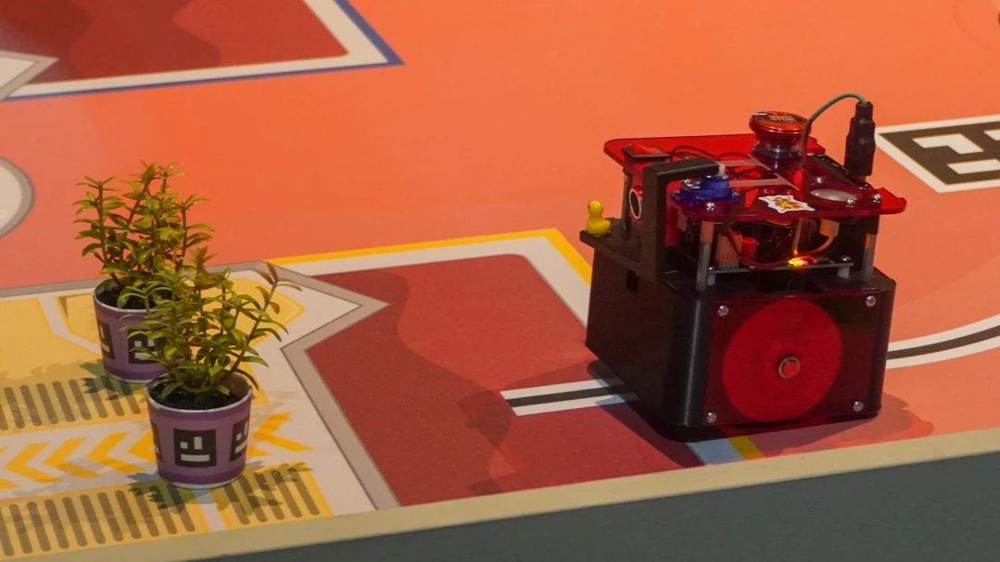

# PAMI

## Introduction

### Mission

Le PAMI n'entre en jeu qu'à partir de la 90e seconde d'un match. Il quitte sa zone de départ et a 10 secondes pour aller toucher une plante ou un pot contenant la plante dans une zone de dépose (action de polliniser). Enfin, il doit rester au contact de la plante jusqu'à la fin du match.

### Contraintes

Il peut :
- être touché par le robot de son équipe, mais pas manipulé.
- se déployer dans la limite d'une augmentation de 10 cm de son périmètre.

Il ne peut pas :
- amener une plante dans une zone.
- sortir une plante d'une zone (invalidation de l'action du PAMI le cas échéant).
- réaliser ses actions dans une zone adverse (points pour l'équipe adverse le cas échéant).
- collisionner un robot autre que celui de son équipe (pressage du bouton d'arrêt d'urgence et disqualification le cas échéant).

De plus, la stratégie développée pour le PAMI varie selon le côté du terrain où il commence. Nous devons donc être capables de sélectionner la bonne stratégie avant le début du match.

En résumé, le PAMI doit pouvoir se déplacer d'un point A (sa zone de départ) à un point B (sa jardinière), en pollinisant une plante dans sa jardinière (contact) et en restant à ses côtés jusqu'à la fin du match.
