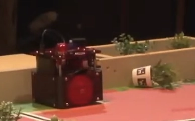
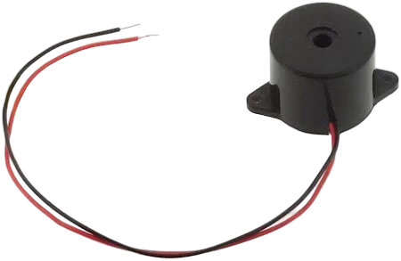

# Obstacles

## Choix du capteur

Afin de donner la possibilité au PAMI de s'arrêter face à un obstacle et ainsi éviter la collision, nous devons choisir un capteur capable de mesurer avec une précision correcte la distance entre le PAMI et l'obstacle. Notre choix s'est naturellement porté sur le [HC-SR05](https://www.kubii.com/fr/modules-capteurs/2042-capteur-ultrason-hc-sr05-kubii-3272496009028.html), un capteur ultrasonique utilisé pour mesurer des distances en émettant des ondes sonores et en calculant le temps que met l'écho à revenir. C'est une solution peu onéreuse et fiable à implémenter.


{: .note}
Le capteur ultrasonique applique la formule `distance = (temps * vitesse_son) / 2`. La vitesse du son dans l'air est de 340 mètres par seconde.

## Lecture des valeurs du capteur

### Identification de problèmes

En testant le capteur, nous nous sommes vite rendus compte que des valeurs parasites étaient retournées. Le PAMI s'arrête seulement si la distance retournée est inférieure ou égale à 31 cm. Le fait d'avoir des valeurs fausses rendait ses déplacements erratiques qui, par la même occasion, sautaient des pas sur les steppers.
Également, le capteur ne peut faire la différence entre une plante ou un robot. De ce fait, le PAMI s'arrête face à n'importe quel obstacle.

### Solution logicielle

Après un certain moment de réflexion, nous avons essayé d'implémenter une moyenne mobile des valeurs afin de filtrer les potentiels parasites. La tâche de lecture du capteur est quant à elle déportée sur le cœur n°2 afin de fluidifier l'exécution du code. Voici à quoi ressemble la fonction de mesure :

1. La fonction soustrait l'ancienne mesure de la somme totale des lectures.
2. Elle lit la nouvelle distance mesurée par le capteur et l'ajoute à la somme totale.
3. Elle met à jour l'index pour garder une trace de la position dans le tableau des lectures.
4. Elle calcule la distance moyenne en divisant la somme totale par le nombre de mesures (dans notre cas, 5).

Nous surveillons en continu la proximité d'obstacles en moyennant sur 5 valeurs et obtenons ainsi une unique valeur filtrée. La solution fonctionnant assez bien pour nous, nous l'avons adoptée.

#### Extrait du code

```c
int readings[SONAR_ITERATIONS], sonar_index = 0, total = 0, average;

for (;;) { // loop cœur n°2
	total -= readings[sonar_index];
	readings[sonar_index] = sonar.read();
	total += readings[sonar_index];

	sonar_index = (sonar_index + 1) % SONAR_ITERATIONS;

	average = total / SONAR_ITERATIONS;

	if (average <= 31) {
		obstacle = true;
		tone(BUZZER, 444);
	} else {
		obstacle = false;
	}
}
```

## Intégration de la détection

### Dans les déplacements

Maintenant que la valeur de notre capteur est utilisable, nous devons interpréter la distance des obstacles. Dans notre cas, nous avons juger qu'une tolérance de 32 cm et plus était acceptable. Le PAMI réagit assez rapidement et cela lui permet de s'arrêter en premier dans le cas d'un choc frontal avec un autre robot. Ainsi, quand le capteur retourne une valeur inférieure ou égale à 31 cm, il signale la présence d'un obstacle en passant la variable booléenne globale `obstacle` à l'état **VRAI**. Dans le cas contraire, cette variable est à l'état **FAUX**. De cette façon, nous savons si les [steppers](./Steppers_Pamis.html) ont le droit d'exécuter leurs pas en consultant tout simplement l'état de la variable.



*Hélas, comme nous ne pouvions pas faire la différence entre une plante ou un robot, le PAMI sur l'image ci-dessus s'arrête face à une plante.*

### En retour sonore

Au moment où la variable `obstacle` est à l'état **VRAI**, nous envoyons un signal à notre buzzer piézoélectrique afin d'avoir un retour sonore de la détection d'obstacles. Tant que l'obstacle est présent, le buzzer émet une note aiguë. Cela a pour avantage une visualisation simplifiée de la lecture du capteur et de l'exécution du code associé.



## Axes d'amélioration

En l'état actuel, nous sommes satisfaits de l'utilisation du capteur ultrasonique. Lors de son utilisation, nous n'avons jamais rencontré de soucis, il était rapide et très simple à implémenter. Le choix de ce capteur était donc judicieux. Mais après avoir pu mettre le PAMI en pratique, quelques axes d'amélioration nous sont venus à l'esprit :

1. Le choix d'un capteur ultrasonique fournissant déjà un filtrage parasite sur la partie hardware peut être plus fiable à utiliser. Cela nous évite de mettre en place une moyenne mobile qui ralentit la détection d'obstacle.
2. Avoir au moins deux capteurs ultrasoniques positionnés à différentes hauteurs pourrait aider à discerner les obstacles négligeables des obstacles critiques (voir l'image du PAMI qui s'arrête face à une plante).

Étudier ces deux points pourrait nous aider à fiabiliser davantage le système de détection d'obstacles.
