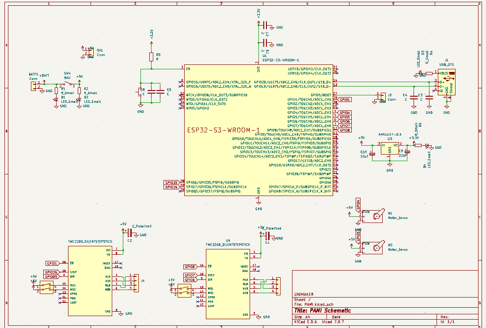
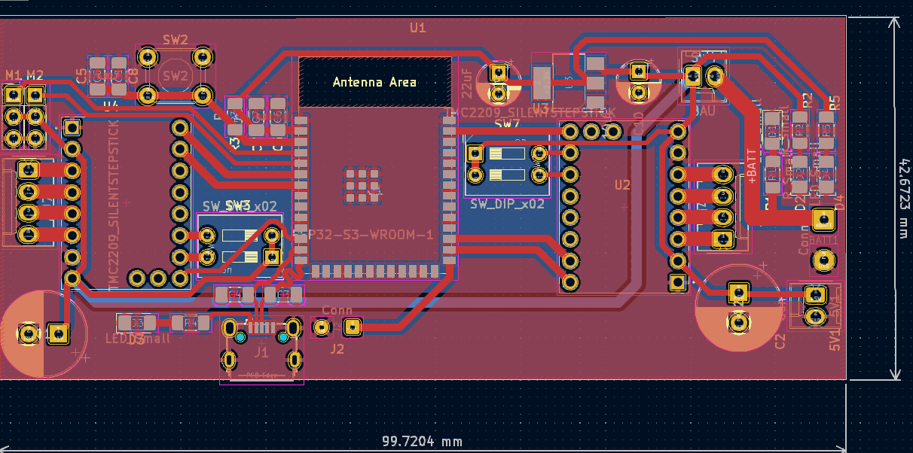

## Spécificités de la version 1 :

Étant ma toute première réalisation de PCB, j'ai opté pour un design visuellement intuitif (voir PCB) comprenant uniquement les composants les plus cruciaux, en essayant de rester sur une carte au minimum compactée en guise de carte test. Ainsi, dans le schéma, vous trouverez l'élaboration des composants phares.
L'objectif dans la réalisation de ce shéma est de mettre en liens les differents composants avec les dipoles dont ils ont besoin pour leur bon fonctionnement.

### Schéma

- L'ESP32-S3-VROOM se met en lien avec des condensateurs pour augmenter la stabilité de son alimentation et limiter les bruits numériques
- Les pins de transport de données du port USB_OTG sont égalements dotés de capacitées pour des raisons de filtrage numérique ainsi que un set résistance/diode connecté à la source d'alimentation du module afin de vérifier son bon fonctionnement. 
- Des switch sont lié aux pins de step des contrôleurs moteurs TMC2209 SILENTSTEPSTICK afin de sélectionner manuellement notre configuration, il a également fallut déporter les pins des bobines magnétiques afin de les ordonnées en vue de leurs branchement.
- Le régulateur de tension Traco TSR_2-2433 est mis ene lien avec des condensateurs de sorte a augmenter la stabilité de la tension, un set resistance/diodes est également ajouté pour son vérifier son bon fonctionnement.
- **Bouton d'activation du microcontrôleur**
- **Interrupteur d'arrêt d'urgence**
- **LEDs de vérification de l'état des circuits**

### PCB

