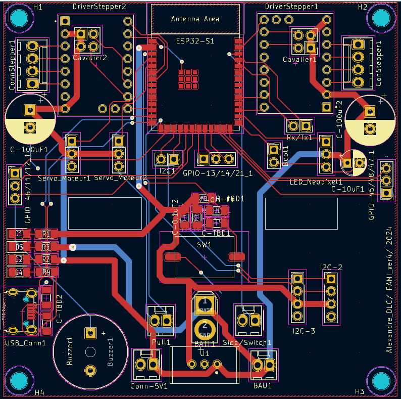

## Ajouts de fonctionnalités

- **Buzzer_Beeper** : Feedback sonore des actions du PAMI.
- **Screen** : Feedback visuel de l'état du PAMI.
- **Interrupteur de changement de stratégie**.
- **Actionneur de LED néopixel**.

## Adaptation du design

- Passage à un format 80x80 mm.
- Ajout de trous pour le passage de câbles.
- Intégration d'une légende.

