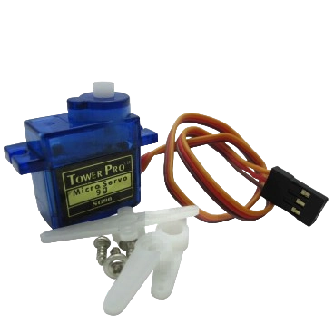

# Pollinisation

## Déploiement du bras

Pour pouvoir polliniser les plantes, le PAMI est équipé d'un bras lié à un servomoteur. Ce bras est déployé à la suite du déplacement du PAMI pour toucher la plante. Le servomoteur utilisé est le [SG90](https://boutique.semageek.com/fr/104-micro-servo-tower-pro-sg90-3007447379574.html), contrôlable sur une plage d'angle de 0° à 180°. Ce choix est justifié par son faible coût et l'utilisation que nous en faisons.

## Stratégie

Lorsque le PAMI a terminé ses déplacements, le servomoteur passe d'un angle de 0° à 45° afin d'étendre le bras pour toucher la ou les plantes. Nous disions dans la partie [obstacles](./Obstacles_Pamis.html) qu'il n'était pas possible pour nous de différencier une plante d'un robot adverse. Ainsi, si le robot ne termine pas son déplacement car un obstacle l'a arrêté, le bras se déploie tout de même dans l'éventualité qu'une plante fasse obstacle.

### En douceur

Si le PAMI renverse une plante, nous n'obtenons pas de points. [à finir]
