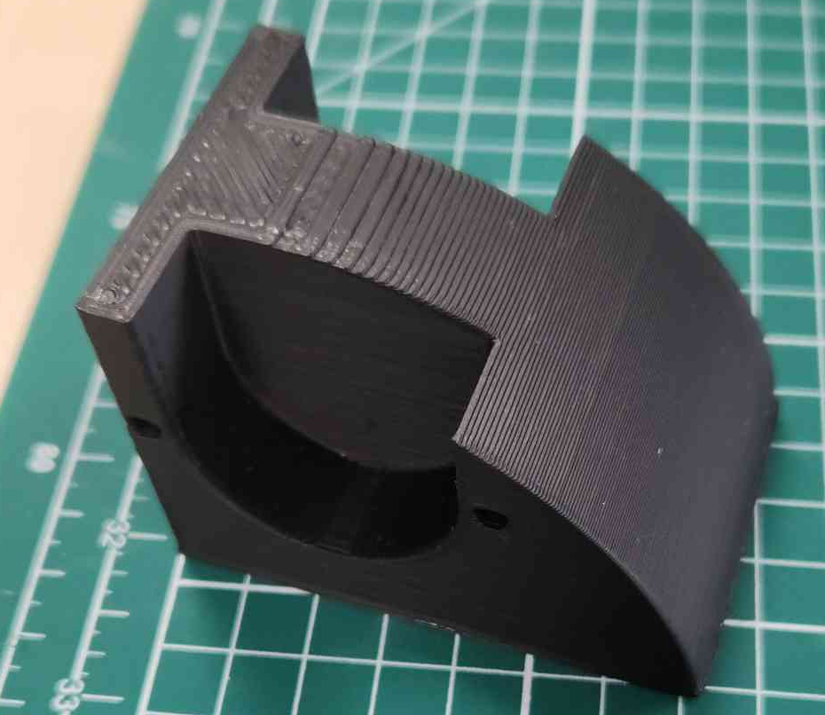

# Conception & Modélisation des PAMI

## Introduction

Les **PAMI** ou (**P**etits **A**ctionneurs **M**obile **I**ndépendant), sont des petits robots qui sont soumis à plusieurs régle pour la conception ce sont les contraintes volumétriques qui nous intéresse le plus. En effets il n'y a pas de nombre limite de PAMI présent sur la table de jeu cependant l'ensemble des PAMI doit tenir dans une zone de 150mm*450mm et 150mm de hauteur. Il ont également une limite de poids fixé a 1.5kg dans le réglement final. Cependant le premiers réglement (béta) limité le poids des PAMI à 1kg. Afin d'être sur de respecté les contrainte volumétriques la conceptin de base sur un volume carré ou rectangulaire que l'on perce afin d'y intégres nos composants.

### PoC (Proof of Concept)

Avant toute conception des PAMI il fallait savoir qu'elle moteur utilisé pour pouvoir concevoir le corps du robot.
Pour ça j'ai utilisé un outils de calcul de couple, ses informations en poche j'ai donc trouvée les settepers que je cherchait des <a href="https://www.omc-stepperonline.com/fr/rond-nema-14-bipolaire-0-9deg-9-ncm-12-75-oz-in-1-0a-36-5x17-5mm-4-fils-14hr07-1004vrn?search=nema%2014%20rond" target="_blank">Nema 14 rond</a> ou pancake.

A la suite de ce choix j'ai donc réalisé rapidement une petite pièce pour validé les moteurs et commencé a imaginée les volumes du PAMI.

La première version est idée pour les PAMI était de faire un maximun de PAMI dans une zone la plus compactre possible. Après plusieur heure de conception j'ai obtenu un premiers modéles 3D. 

