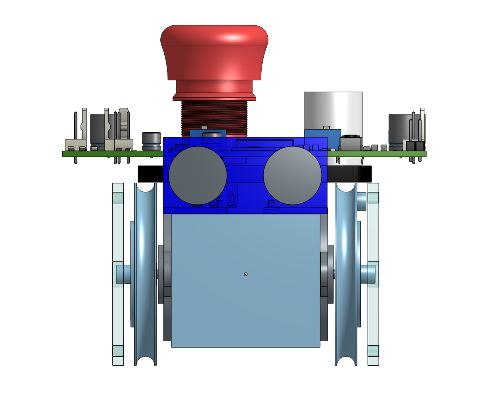
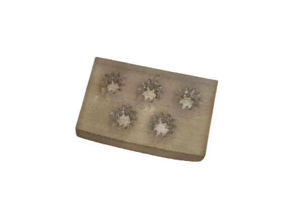
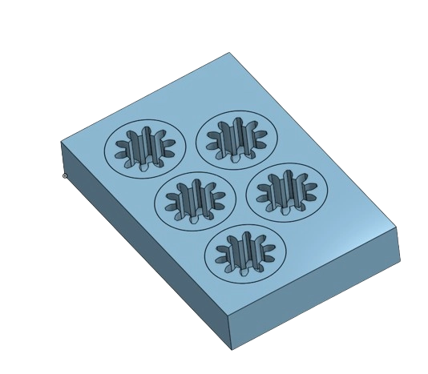

# Conception & Modélisation des PAMI

## V1

<model-viewer disable-zoom src="../../models/PAMI_v1.gltf" ar ar-modes="webxr scene-viewer quick-look" camera-controls tone-mapping="neutral" poster="../../models/poster_pamiv1.webp" shadow-intensity="1" height="500%" weight="500%"> </model-viewer>

La premiers version était uniquement théorique car elle n'a jamais était imprimé. 
Cette version n'a jamais été concrétisée car mom objectif de faire des PAMI les plus petits possible était compliquées et surtout mal abordé.
Cependant elle m'as permis de mettre sur table tout les élements nessesaire au PAMI est de mieux visualiser par  la suite l'ensemble des élements a modélisée 

### Etalonnage

Les Nema 14 rond sont équipe d'un engrenage directement soudée sur l'arbre du moteur il m'a donc fallut modélisée unue roue aillant le négatif de cette engrenage pour une intégration obtimal. 
Les marges d'erreur étant trés petit j'ai donc réaliser une pièce d'etalonnage pour test différente valeur. 
Pour une présision maximale j'ai décider d'imprimé les roue en résine. 
J'ai réitere les processus d'intégres les moteurs au mieux dans le corps (body) du robots.

Cette étalonnage fait également partie d'une démarche écologique car elle permet de test plusieur valeur avec un minimun de plastique utilisée.

### Conclusion

Après avoir passer plusieur heure sur cette modélisation et pris en note plusieur point : 

    - Il faut une surface pour fixé les composant
    - Le robot est trop petit
    - Il faut trouvée une vrai batterie, celle-ci n'est que théorique et trouvé comment l'attacher
    - Le robot a besoins d'au moins une bille folle d'éqilibrage avant arriére.  