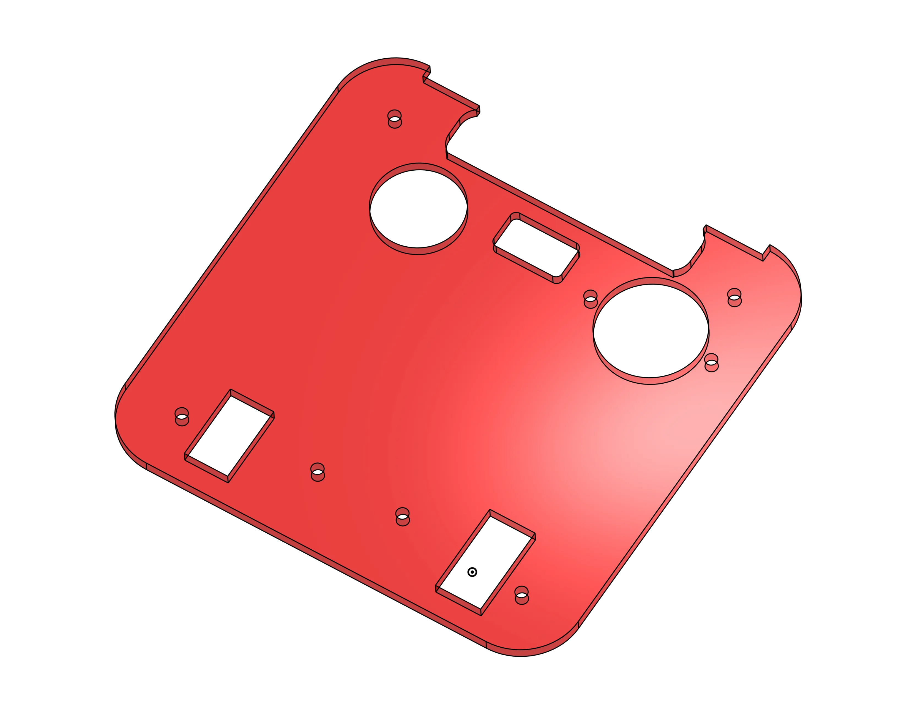
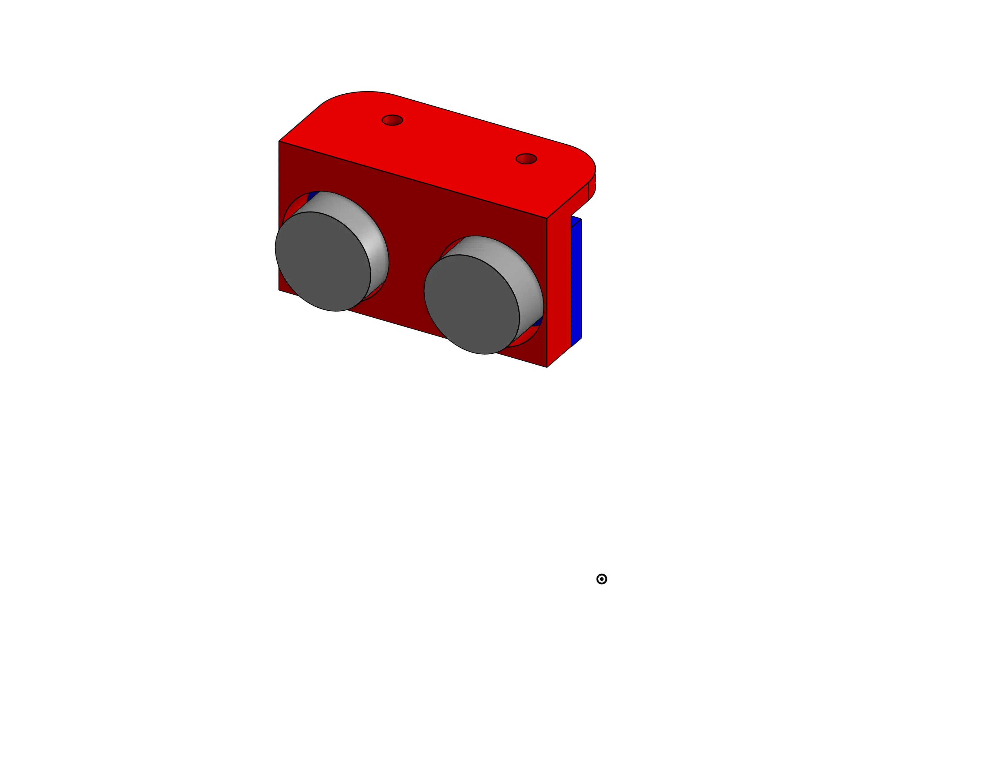
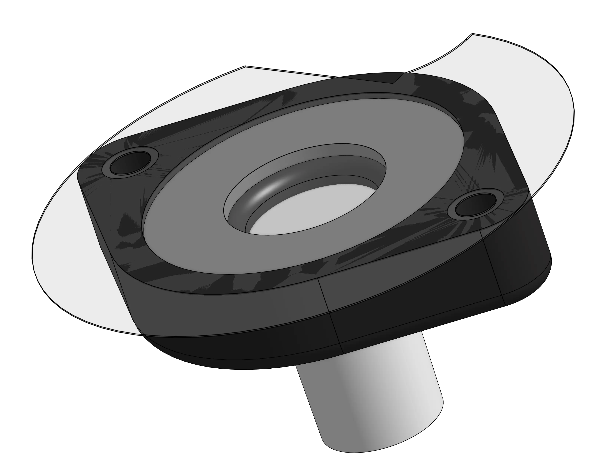
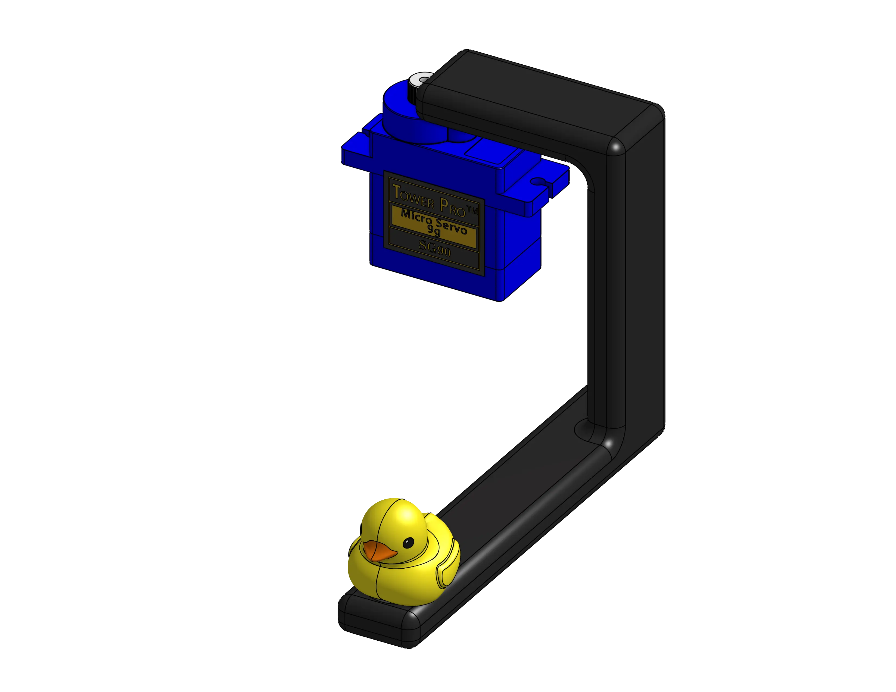

# Conception & Modélisation des PAMI

## Version Finale

<model-viewer src="./3d_files/pami-vfinal.glb" ar ar-modes="webxr scene-viewer quick-look" camera-controls tone-mapping="neutral" poster="./3d_files/v3.webp" shadow-intensity="1" style="display: block; margin-left: auto; margin-right: auto; height: 600px; width: 600px;">
    

        

    

</model-viewer>

La version 3, ou version finale, est une continuité et une amélioration du concept de la V2. Le changement principal est le remplacement des steppers par une nouvelle référence. La grande modification est le changement complet de l'emplacement des composants, passant d'un agencement circulaire à un agencement carré.

Avec le body réadapté et la carte finale réalisée, nous avons pu continuer notre conception. Sur la plaque supérieure, il fallait intégrer plusieurs emplacements pour les différents composants qui s'y fixent :

- Un emplacement pour visser le bouton d'arrêt d'urgence
- Un support pour le capteur Reed
- Un emplacement pour le switch de stratégie (bleu ou jaune)
- Un support et une attache pour le capteur ultrason
- Un emplacement pour le servo-moteur destiné à toucher les plantes

    
    
    
    

Une fois tous les prototypes validés, nous sommes passés au montage final des PAMI 2 et 3. En voici le résultat.

    <video muted autoplay loop>
        <source src="./3d_files/pami-montage.webm" type="video/webm">
    </video>

## Conclusion

Le développement du PAMI a été un projet évolutif marqué par de multiples améliorations et différents échecs. De la version initiale à la version finale, chaque étape a permis de résoudre des problèmes et d'optimiser la conception pour atteindre progressivement les objectifs fixés en termes de fonctionnalité et de performance.
