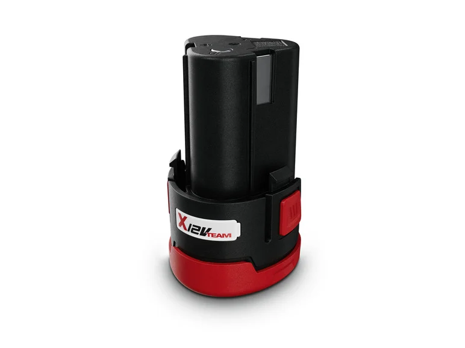

## Sans éléments, on n'ira pas loin

Les robots comportent plusieurs systèmes de nature différente. Pour notre robot, nous avons identifié les systèmes suivants :

- Systèmes mécaniques
- Systèmes électroniques
- Systèmes lumineux

Chacun de ces systèmes joue un rôle distinct dans le fonctionnement du robot, mais ils ne fonctionnent pas indépendamment. Ils sont soigneusement interfacés pour que chaque composant contribue efficacement à l'ensemble du robot.

## Le mouvement, on y va de "pas en pas"

Pour le mouvement, nous avons opté pour des moteurs pas à pas Nema 17, couramment utilisés dans les imprimantes 3D et connus pour leur couple adéquat pour des systèmes légers.

<model-viewer disable-zoom src="./Hardware_files/Nema17.glb" ar ar-modes="webxr scene-viewer quick-look" camera-controls tone-mapping="commerce" poster="./Hardware_files/poster.webp" shadow-intensity="1"> </model-viewer>

Voici la [documentation](https://www.omc-stepperonline.com/fr/nema-17-bipolaire-45ncm-64oz-in-2a-42x42x40mm-4-fils-avec-1m-de-cable-et-connecteur-17hs16-2004s1) du Nema 17 utilisée.

<embed src="./Hardware_files/17HS16-2004S1.pdf" type="application/pdf" style="width: 100%; height: 100vh; border: none; display: block; margin: 0; padding: 0;"/>

Nous avons choisi ce modèle de moteur en utilisant le calculateur disponible sur le site du makerspace, en fonction du cahier des charges prévisionnel suivant :

[Calculateur en ligne](https://makerspace-amiens.fr/pages/calculateur-moteur-robot/){: .btn .btn-purple }

| Caractéristique         | Valeur |
|-------------------------|--------|
| Poids                   | 6 kg   |
| Vitesse                 | 0,5 m/s|
| Accélération            | 2 m/s² |
| Nombre de moteurs       | 2      |
| Rayon roue motrice      | 60 mm  |
| Tension d'alimentation  | 12 V   |
| Efficacité              | 65%    |
| Temps de fonctionnement | 2 h    |

Cependant, nous avons constaté que ces moteurs ne fournissaient pas le couple attendu en pratique, probablement en raison de la qualité des marques noname que nous avions. Cela nous a conduits à choisir un modèle supérieur, les Nema 23. Voici la [documentation](https://www.omc-stepperonline.com/fr/nema-23-bipolaire-1-8deg-0-9-nm-127-5oz-in-2a-3-6v-57x57x52mm-4-fils-23hs20-2004s).

<embed src="./Hardware_files/23HS20-2004S.pdf" type="application/pdf" width="100%" height="560px" />

Ces moteurs sont un peu plus encombrants que les Nema 17, mais ils permettent d'utiliser le robot en transmission directe (direct drive), c'est-à-dire que la roue est directement fixée sur l'arbre moteur.

<model-viewer src="./Hardware_files/NEMA23.gltf" ar ar-modes="webxr scene-viewer quick-look" camera-controls tone-mapping="commerce" poster="./Hardware_files/Nemaposter.webp" shadow-intensity="1" disable-zoom>
    

        

    

</model-viewer>

Un moteur pas à pas fonctionne en effectuant des rotations par pas. Un changement de polarité permet de passer d'une position à une autre. Dans notre cas, ce changement est géré par notre programme via un driver nommé TMC2209. La [documentation du TMC2209 ici](https://www.analog.com/en/products/TMC2209.html).

<embed src="./Hardware_files/TMC2209_datasheet_rev1.08.pdf" type="application/pdf" width="100%" height="600px" />

Pour les mouvements des actionneurs, nous avons principalement utilisé des servomoteurs. Ce sont des moteurs à courant continu (DC) qui intègrent un régulateur de position. En envoyant un signal PWM (pulse width modulation), en français MLI (modulation de largeur d'impulsion), nous pouvons commander le moteur à se positionner à un certain angle. 
Les références que nous avons utilisées sur le robot sont :
- FS 5115M [documentation ici](https://www.gotronic.fr/pj2-fs5115m-2553.pdf)
- Servo MG996R [documentation ici](./Hardware_files/mg996r.pdf)

<model-viewer src="./Hardware_files/MG996RServo.glb" ar ar-modes="webxr scene-viewer quick-look" camera-controls tone-mapping="commerce" poster="./Hardware_files/posterServo.webp" shadow-intensity="1">
    

        

    

</model-viewer>

## Une source d'énergie, et ce n'est pas de la vapeur !

Comme source d'énergie, nous avons opté pour des batteries déjà disponibles dans le club, notamment les Parkside A3.

Deux de ces batteries sont en série dans le robot pour augmenter la tension vers 24V, ce qui permet de suivre les courbes de couple proposées par les Nema 23.

Pour l'autonomie de ces batteries, nous sommes aux alentours de 1h30 voire 2h.

