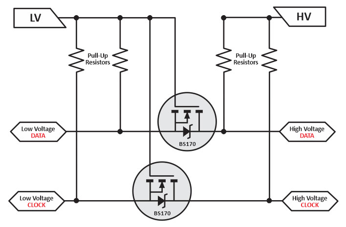

## La premiere Carte electronique

Objectif: Créer une carte de commande des differents systèmes éléctronqiue que comporte le robot

<kicanvas-embed src="./V1_carte_files/MainBoardV1.kicad_sch" controls="basic"> </kicanvas-embed>

Sur cette premiére carte, Nous étions passé sur un module ESP32 S3, cette module est un ensemble de composant sur un mini pcb enfermée dans une cage de faraday, 
permetant de reduire les nuissance de l'exterieur. plus sur cette microcontroleur [ici] (https://www.espressif.com/sites/default/files/documentation/esp32-s3_datasheet_en.pdf)

Le robot à 3 moteur pas à pas a controler, c'est a dire qu'il nous faut 3 controlleurs pas à pas, de nombreux composants et BOB (break out boards) sont sur le marché qui répondent a cette demande.

Les plus communnement trouvé sont les DRV, TMC et a4988.

Par facilité d'accès nous avons commencé avec les DRV8825 puisqu'il il etaient déja dans l'association unimakers, mais les 3 driver sont interchangeable, avec 
des condition special. (il faut que le circuit soit adapté pour selectioner un drv8825 ou un TMC2209, ce sera étudiée dans un futur version de la carte)

il nous faut aussi des connecteurs I²C pour pouvoir connecter des cartes compatible protocole. On utilise des connecteur JST pour ce faire, car la taille permet 
de ne pas trop etre encombrant, et pourtant facile a brancher.

Les connecteurs sur cette premiere carte etait en 5V, problématique car l'esp32 n'est pas tolérant 5v, pour courte durée ça pourrait fonctionner, mais sur 
longue durée ça pourrait cramér l'esp32, ou au moin une des registres.
Une idée aurait été d'implémenter un ciruit de traduction tension logique, qui passe le 3,3V en 5v et l'inverse.

Mais comme sur le marché, on trouvera de nombreuses composants en 3.3V, il est préférable de passer la tension d'alimentation I²C par la suite en 3.3v (voire prochaine carte)

La tension passe par un transformateur qui baisse la tension d'entrée de 12v à 5v, ensuite la tension 5v passe par un AMS117 qui baisse la tension vers 3,3v 
pour alimenter l'esp32.

Sources:
[Level shifter](https://www.digikey.com/en/blog/logic-level-shifting-basics)