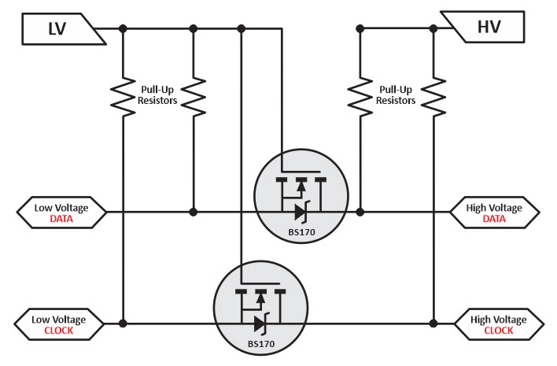

## La première Carte Électronique

**Objectif :** Créer une carte de commande pour les différents systèmes électroniques du robot.

<kicanvas-embed src="./V1_carte_files/MainBoardV1.kicad_sch" controls="basic"></kicanvas-embed>

Pour cette première carte, nous avons utilisé un module ESP32 S3. Ce module est un ensemble de composants sur un mini PCB, enfermé dans une cage de Faraday, permettant de réduire les interférences extérieures. Pour plus de détails sur ce microcontrôleur, consultez [la documentation de l'ESP32 S3](https://www.espressif.com/sites/default/files/documentation/esp32-s3_datasheet_en.pdf).

Le robot nécessite le contrôle de trois moteurs pas à pas, ce qui implique l'utilisation de trois contrôleurs pas à pas. Il existe de nombreux composants et BOB (breakout boards) sur le marché qui répondent à cette demande. Les plus couramment utilisés sont les DRV, TMC et A4988.

Pour des raisons de disponibilité, nous avons commencé avec les DRV8825 car ils étaient déjà présents dans l'association Unimakers. Cependant, ces trois types de drivers sont interchangeables sous certaines conditions. Le circuit doit être adapté pour sélectionner un DRV8825 ou un TMC2209, ce qui sera étudié dans une future version de la carte.

Nous avons également besoin de connecteurs I²C pour connecter des cartes compatibles avec ce protocole. Nous utilisons des connecteurs JST car ils sont suffisamment petits pour ne pas être encombrants, tout en étant faciles à brancher.

Les connecteurs sur cette première carte étaient en 5V, ce qui posait problème car l'ESP32 n'est pas tolérant au 5V. À court terme, cela pourrait fonctionner, mais à long terme, cela pourrait endommager l'ESP32, ou au moins l'un de ses registres. Une solution aurait été d'implémenter un circuit de traduction de niveau logique, pour convertir le 3,3V en 5V et inversement.

Cependant, comme il existe de nombreux composants en 3,3V sur le marché, il est préférable de passer la tension d'alimentation I²C en 3,3V dans les versions futures de la carte.

La tension passe par un transformateur qui abaisse la tension d'entrée de 12V à 5V, puis la tension de 5V passe par un AMS117 qui abaisse la tension à 3,3V pour alimenter l'ESP32.

On peut apercevoir un connecteur UART (Universal Asynchronous Receiver Transmitter) qui se connecte à l'UART 1 de l'ESP32. Ce connecteur permet de communiquer avec un lidar situé au-dessus du robot (voir lidar).

Un interrupteur est présent pour alimenter l'ESP soit via l'USB, soit via l'alimentation de la batterie du robot, mais jamais les deux en même temps (cela pourrait causer des problèmes).

**Sources :**
- [Level shifter](https://www.digikey.com/en/blog/logic-level-shifting-basics)
- [ESP32](https://www.espressif.com/en/products/socs/esp32-s3)
