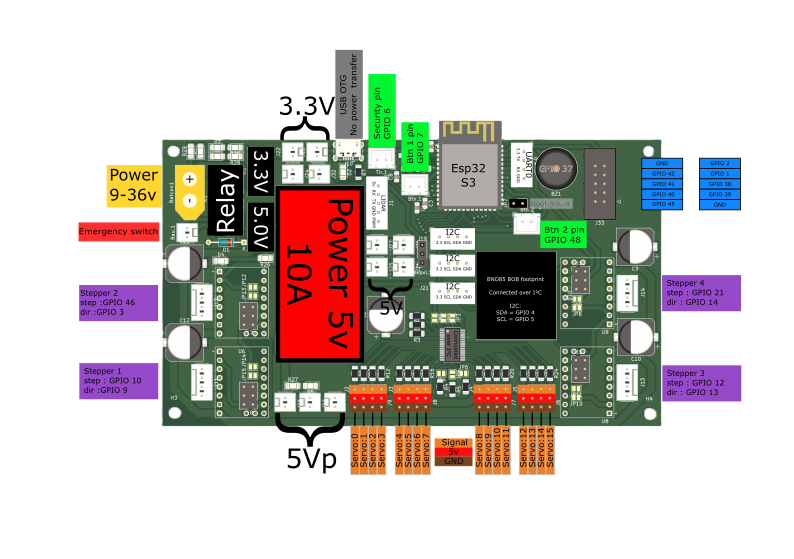

# Le temps est écoulé, le 4e candidat est retenu

<kicanvas-embed controls="full">
    <kicanvas-source src="./V4_carte_files/MainBoardV4.kicad_sch"></kicanvas-source>
    <kicanvas-source src="./V4_carte_files/Meca.kicad_sch"></kicanvas-source>
    <kicanvas-source src="./V4_carte_files/Power.kicad_sch"></kicanvas-source>
    <kicanvas-source src="./V4_carte_files/Servo.kicad_sch"></kicanvas-source>
    <kicanvas-source src="./V4_carte_files/Logic.kicad_sch"></kicanvas-source>
    <kicanvas-source src="./V4_carte_files/steppers.kicad_sch"></kicanvas-source>
    <kicanvas-source src="./V4_carte_files/MainBoardV4.kicad_pcb"></kicanvas-source>
</kicanvas-embed>

Voici la dernière carte à jour qui a participé à la coupe dans le robot. Cette carte nous a permis d'avoir tout ce dont nous avions besoin pour que le robot fonctionne correctement. Par rapport à la V3, cette carte a tous ses composants d'un seul côté du PCB, ce qui nous permettait de router tous les fils d'un côté du robot, minimisant les risques que les actionneurs s'emmêlent dans les fils.

Voici un schéma résumant les fonctionnalités de la carte !

Quelques caractéristiques de cette carte :

| **Éléments**             | **Détail**                                                                                                                                            |
| ------------------------ | ----------------------------------------------------------------------------------------------------------------------------------------------------- |
| Tension d'alimentation   | Min : voir Traco puissance, Max : 36V                                                                                                                 |
| Type de microcontrôleur  | ESP32-S3-WROOM-1-8MB                                                                                                                                  |
| Type de contrôleur Servo | PCA9685PW, connecté en I²C                                                                                                                            |
| Emplacements Servo       | 16x, supportant jusqu'à 10A partagés                                                                                                                  |
| Type de driver           | Par défaut : TMC2209, configurable en DRV8825 ou A4988                                                                                                |
| Configuration drivers    | TMC2209 : pas de configuration nécessaire, DRV8825/A4988 : souder les jumpers                                                                         |
| Type de relais           | Relay_SPST_TE_PCH-1xxx2M, ou à shunter en cas d'absence                                                                                               |
| Configuration relais     | Choisir le relais en fonction de la tension utilisée. Sinon, shunter les connexions entre la COM et NO ! Ne pas utiliser le BAU sur carte si shunté ! |
| Type de gyroscope        | BNO_085 en I²C                                                                                                                                        |
| Tension de sortie 3,3V   | Jusqu'à 2 ampères, partagés avec l'ESP32, les drivers et l'I²C                                                                                        |
| Tension de sortie 5V     | Jusqu'à 2 ampères, partagés avec le LIDAR et Neopixel                                                                                                 |
| Connecteurs I²C          | 3,3V, partagés avec l'ESP32                                                                                                                           |
| Connecteur Lidar         | 5V, partagés avec Neopixel, UART 1, PWM                                                                                                               |
| Connecteur Nappe         | Compatible avec les cartes AREA                                                                                                                       |

> je laisse un peu de santé physique [ici](https://www.youtube.com/watch?v=dQw4w9WgXcQ) -Dylan