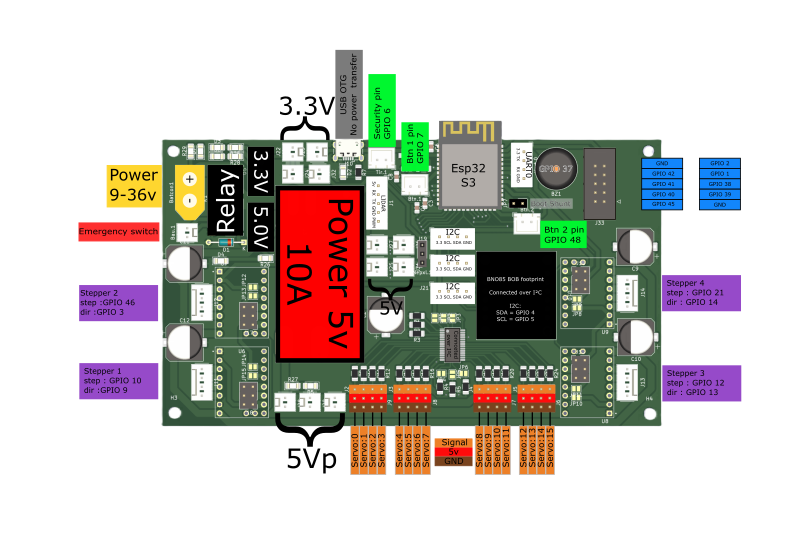

# Le temps est écoulé, le 4e candidat est retenu

<kicanvas-embed controls="full">
    <kicanvas-source src="./V4_carte_files/MainBoardV4.kicad_sch"></kicanvas-source>
    <kicanvas-source src="./V4_carte_files/Meca.kicad_sch"></kicanvas-source>
    <kicanvas-source src="./V4_carte_files/Power.kicad_sch"></kicanvas-source>
    <kicanvas-source src="./V4_carte_files/Servo.kicad_sch"></kicanvas-source>
    <kicanvas-source src="./V4_carte_files/Logic.kicad_sch"></kicanvas-source>
    <kicanvas-source src="./V4_carte_files/steppers.kicad_sch"></kicanvas-source>
    <kicanvas-source src="./V4_carte_files/MainBoardV4.kicad_pcb"></kicanvas-source>
</kicanvas-embed>

Voici la dernière carte à jour qui à participé a la coupe dans le robot, cette carte nous a permis d'avoir tout ce dont on avais besoin pour que le robot fonctionne correctement.
Par rapport a la V3, cette carte a tout ses composant d'une seule coté du pcb, ce qui nous permetai de router tout les fils d'une coté du robot, minimisant les risque que les actioneurs
se prennent dans des fils.

Voici une schématique résumant les foncitonalité de la carte!

Quelques caratéristique de cette carte 

| Eléments                 | Détail                              |
|--------------------------|-------------------------------------|
| Tension d'Alimentation   | Min: voir traco puissance, Max: 36V |
| Type de MicroContrôleur  | Esp32-S3-WROOM-1-8MB                |
| Type de Controleur Servo | PCA9685PW                           |