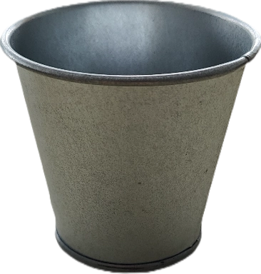
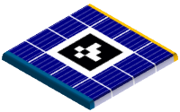

# Le robot principal

<model-viewer src="./RobotModels/Robot.gltf" ar ar-modes="webxr scene-viewer quick-look" camera-controls tone-mapping="neutral" poster="./RobotModels/RobotPoster.webp" shadow-intensity="0" exposure="0.62" shadow-softness="0" style="display: block; margin-left: auto; margin-right: auto; height: 600px; width:600px;">
    

        

    

</model-viewer>

## Introduction

### Missions

Le robot commence dès le démarrage d'un match. En quittant sa zone de départ, il a le choix de réaliser trois tâches :

Prendre des plantes, prendre des pots et tourner les panneaux solaires.
À la fin du match, le robot doit se trouver dans une zone différente de sa zone de départ.

### Contraintes

Le robot est autorisé à :

- Manipuler les éléments.
- Voler des plantes des zones non protégées.
- Tourner les panneaux solaires de sa couleur de match et les panneaux partagés.

Le robot n'est pas autorisé à :

- Nuire à l'adversaire.
- Défendre une zone volontairement.
- Voler des plantes dans les jardinières.
- Heurter l'adversaire.

Dans la suite de la documentation, vous verrez les différents actionneurs, capteurs et microcontrôleurs utilisés pour le robot.
