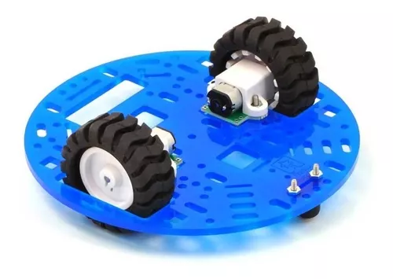
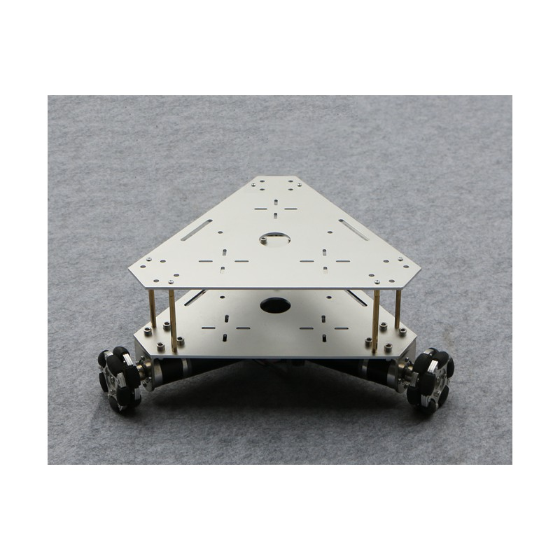
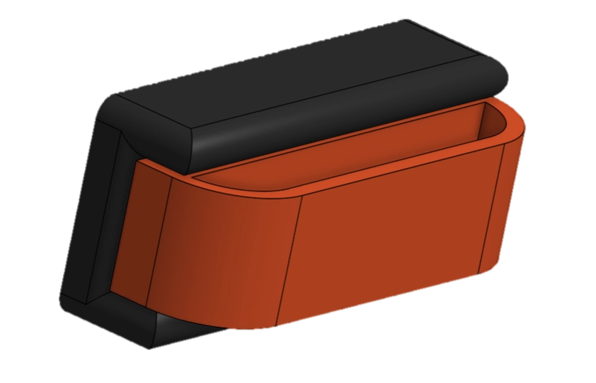
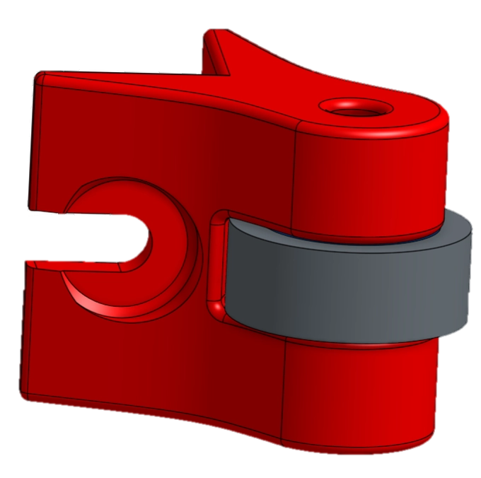

# Le châssis

## Comment fabriquer un bon châssis ?

Le châssis constitue la pièce maîtresse des robots, ayant pour rôle de supporter l'ensemble de leur masse tout en fournissant une structure robuste et rigide.
Un châssis de qualité est indispensable pour assurer la stabilité et la résistance du robot pendant ses déplacements et ses interactions avec l'environnement.

Un châssis bien conçu permet de répartir efficacement les charges et les contraintes sur l'ensemble du robot, réduisant ainsi les risques de déformation ou de rupture.
Il doit être capable de supporter les forces et les vibrations générées par les mouvements du robot, ainsi que les charges supplémentaires, telles que les capteurs, les actionneurs et les batteries.

Pour garantir la performance, la stabilité et la durabilité d'un robot, un châssis de qualité est essentiel.
Sa conception doit être minutieuse, en prenant en compte les contraintes mécaniques auxquelles le robot sera soumis et les exigences spécifiques de la tâche à accomplir.

La première étape consiste à identifier tous les éléments qui devront être fixés sur le châssis. Pour ce robot, la liste est la suivante :

- **Bille folle** : Permet des rotations efficaces du robot.
- **Le barillet** : fixation du moteur du bariellet au châssis.
- **Les MakerBeam** : Permettent la fixation du châssis avec les différentes planches de rigidification.
- **Supports moteurs** : Permettent la fixation des moteurs au châssis.
- **Support batterie** : Permet la fixation de la batterie au châssis.

En prenant en compte ces éléments, le châssis doit être conçu pour optimiser la répartition des charges et assurer la robustesse nécessaire au bon fonctionnement du robot.

# La conception du châssis

## Différentes étapes de développement

### <ins>Holonome ou Différentiel ?</ins>

La première étape du développement a consisté à décider entre une base roulante holonome et une transmission différentielle.

Un <ins>robot holonome</ins> est un type de robot dont les systèmes de déplacement permettent une mobilité dans toutes les directions de manière indépendante et instantanée. Cette capacité est obtenue grâce à l'utilisation de roues spéciales, telles que les roues omnidirectionnelles ou les roues Mecanum, qui peuvent générer des vecteurs de mouvement dans plusieurs directions. Les caractéristiques techniques et les avantages d'un robot holonome incluent :  

- Mobilité omnidirectionnelle : Permet des mouvements latéraux, diagonaux, en rotation sur place, et combinés, offrant une grande flexibilité dans des environnements complexes.  
- Contrôle de mouvement précis : Les systèmes de commande peuvent calculer et exécuter des trajectoires complexes, facilitant les manœuvres dans des espaces restreints.
- Complexité mécanique et algorithmique : Nécessite des algorithmes avancés pour coordonner les mouvements des roues et garantir des déplacements fluides et précis.  

Les robots holonomes sont souvent utilisés dans des applications où la capacité à se déplacer librement dans toutes les directions est cruciale, comme dans la robotique de service, la logistique intérieure, et les compétitions de robotique.

Un <ins>robot différentiel</ins> utilise un mécanisme de transmission où les roues motrices sont fixées de manière indépendante, généralement sur les côtés gauche et droit du robot. La direction et la vitesse du mouvement sont contrôlées en variant les vitesses relatives de ces roues. Les caractéristiques techniques et les avantages d'un robot différentiel incluent :  

- Simplicité mécanique : La conception est généralement plus simple, avec deux moteurs contrôlant deux roues principales, souvent accompagnées de roues passives ou de roulettes pour la stabilité.  
- Facilité de contrôle : La navigation est basée sur des commandes simples de vitesse différentielle, où la différence de vitesse entre les roues gauche et droite permet de tourner.  
- Fiabilité et robustesse : Moins de composants mécaniques complexes réduisent les points de défaillance potentiels, ce qui améliore la robustesse et la maintenance.  

Les robots différentiels sont largement utilisés dans la robotique mobile.

Le premier prototype utilisait une base roulante holonome pour permettre au robot de se mouvoir dans toutes les directions, avec un châssis triangulaire et des extrémités modulables.

Suite à divers tests, une base roulante en transmission différentielle a été choisie pour optimiser l'espace de stockage des plantes en utilisant deux moteurs.

Le choix d'une transmission différentielle pour la base roulante de notre projet présente plusieurs avantages importants, particulièrement dans le contexte d'optimisation de l'espace de stockage des plantes. Voici une argumentation détaillée :

#### <ins>Maniabilité et Précision :</ins>  
Une transmission différentielle, utilisant deux moteurs, permet un contrôle précis de chaque roue. Cela signifie que la base roulante peut effectuer des virages sur place (pivotement), ce qui est essentiel dans des espaces restreints comme ceux souvent rencontrés dans des installations de stockage de plantes. Cette maniabilité permet une utilisation plus efficace de l'espace disponible, réduisant les besoins en allées larges et optimisant la disposition des plantes.

#### <ins>Efficacité de l'Espace :</ins>  
L'utilisation de deux [moteur pas-à-pas](../Hardware/Hardware.html) pour une transmission différentielle permet une conception compacte de la base roulante. Contrairement à des systèmes de transmission plus complexes ou volumineux, la transmission différentielle peut être intégrée dans des structures plus petites, laissant plus de place pour les plantes elles-mêmes. Cela est crucial pour maximiser la capacité de stockage sans sacrifier la mobilité ou la performance.

#### <ins>Simplicité Mécanique et Maintenance :</ins>  
Les systèmes de transmission différentielle sont souvent plus simples à construire et à entretenir par rapport à des systèmes de transmission à plusieurs étages ou à engrenages complexes. Cette simplicité mécanique se traduit par une fiabilité accrue et une réduction des besoins de maintenance, ce qui est bénéfique pour une installation de stockage où l'accès aux mécanismes internes peut être limité.

#### <ins>Adaptabilité et Flexibilité :</ins>  
Avec deux moteurs indépendants, la base roulante peut être facilement ajustée pour répondre à différentes configurations de stockage ou à des besoins spécifiques de déplacement. Par exemple, en modifiant simplement les vitesses relatives des moteurs, la base roulante peut adapter sa trajectoire pour naviguer efficacement dans divers arrangements de stockage.

#### <ins>Répartition du Poids :</ins>  
La transmission différentielle permet une meilleure répartition du poids sur la base roulante. En contrôlant indépendamment chaque moteur et donc chaque roue, il est possible de maintenir une stabilité optimale même lorsque la charge est inégale, ce qui est souvent le cas dans des systèmes de stockage dynamique où les plantes peuvent être déplacées ou redistribuées fréquemment.

En conclusion, le choix d'une transmission différentielle pour la base roulante est justifié par sa capacité à optimiser l'espace de stockage des plantes grâce à une maniabilité supérieure, une utilisation efficace de l'espace, une simplicité mécanique, une adaptabilité élevée et une répartition optimale du poids. Ces avantages combinés permettent de créer un système de stockage plus efficace, flexible et facile à maintenir, répondant parfaitement aux exigences d'un environnement de stockage de plantes.

### <ins>Les roues</ins>

La conception des roues est une étape primordiale pour les déplacements du robot.
La forme et la fonctionnalité des roues influencent directement la mobilité, la stabilité et l'efficacité énergétique du robot.
À mesure que nos besoins et exigences ont évolué, la conception des roues a également subi plusieurs itérations.
En conséquence, un total de quatre versions distinctes de roues ont été créées, chacune présentant des formes et caractéristiques uniques adaptées aux divers défis rencontrés.

La conception des roues a été un processus évolutif, chaque version apportant des améliorations significatives basées sur les retours des tests et les exigences opérationnelles.
Cette approche itérative a permis de développer des roues optimisées pour une performance maximale, garantissant ainsi la mobilité efficace et fiable du robot dans diverses conditions.

### <ins>Symétrie pour une meilleure stabilité</ins>

La troisième version du châssis présente une symétrie avec un espace central traversant. Un carter a été créé pour loger la carte électronique, la batterie, les boutons et le bouton d'arrêt d'urgence. Des billes folles ont été installées aux quatre coins du robot pour stabiliser les déplacements, car les roues placées au centre provoquaient un basculement avant-arrière. Les supports des billes folles peuvent également accueillir des roulements pour ne pas endommager la table.

*(cf : 3D V3)*

### <ins>Les élements de stabilité</ins>

Afin d'assurer la stabilité du robot lors de ses déplacements, des billes folles ont été installées à l'arrière du robot et des roulements ont été fixés au support moteur à l'avant.
Cette configuration présente plusieurs avantages significatifs.

Les billes folles à l'arrière permettent une grande liberté de mouvement dans toutes les directions.
Elles réduisent la friction avec le sol et facilitent les manœuvres, surtout lors des virages serrés ou des changements de direction rapides.
De plus, elles contribuent à une meilleure répartition du poids, ce qui aide à maintenir l'équilibre du robot, notamment sur des surfaces inégales.

Les roulements fixés au support moteur à l'avant assurent une rotation fluide et stable des roues motrices.
Ils minimisent la résistance et les pertes d'énergie, ce qui améliore l'efficacité des déplacements du robot.
En fournissant un support stable et robuste pour les roues avant, les roulements aident à maintenir une trajectoire rectiligne et à réduire les vibrations, contribuant ainsi à la précision et à la fiabilité des mouvements.

En combinant des billes folles à l'arrière et des roulements à l'avant, on obtient une solution efficace pour stabiliser le robot.
Cette approche permet de maximiser la maniabilité et la réactivité du robot tout en assurant une stabilité optimale, ce qui est essentiel pour les applications exigeant une précision élevée et une adaptabilité à différents environnements. 

### <ins>Dispositif pare-chocs</ins>

Afin de se conformer au règlement, des dispositifs pare-chocs ont été installés à l'arrière du robot et des roulements ont été placés tout autour de celui-ci pour éviter d'endommager la table de jeu.

Les pare-chocs jouent un rôle crucial dans la protection du robot et de l'environnement de jeu. En absorbant les chocs lors des recalage bordure, ils minimisent les risques de dommages à la structure du robot. De plus, en répartissant l'impact, ils contribuent à la stabilité globale du robot, permettant un fonctionnement plus fluide et fiable pendant les compétitions.

Les roulements, quant à eux, assurent une interaction douce entre le robot et la surface de la table de jeu. Ils réduisent la friction et préviennent les rayures ou autres dommages sur la surface de jeu, garantissant ainsi un environnement de compétition équitable et préservé. En protégeant à la fois le robot et la table de jeu, ces dispositifs sont essentiels pour maintenir l'intégrité et la durabilité de l'équipement, tout en respectant les exigences du règlement.

### <ins>Le carter</ins>

Afin de pouvoir fixer la carte électronique ainsi que les différents boutons et écrans, un carter a été créé à cet effet.

Le carter joue un rôle essentiel dans la protection et l’organisation des composants internes du robot.
Il offre plusieurs avantages majeurs :

- **Protection des composants électroniques** : Le carter protège la carte électronique et autres composants sensibles des impacts, de la poussière et des débris, prolongeant ainsi leur durée de vie et assurant leur bon fonctionnement.

- **Organisation interne** : En maintenant les boutons, les écrans et la carte électronique en place, le carter facilite le câblage et réduit les risques de court-circuit. Une disposition ordonnée des composants rend également la maintenance et les réparations plus simples et plus rapides.

- **Accessibilité** : Avec des ouvertures et des supports bien placés, le carter permet un accès facile aux boutons et aux écrans, améliorant ainsi l'interaction avec le robot. Cette accessibilité est cruciale pour effectuer des ajustements rapides et pour un contrôle efficace de l’appareil.

- **Esthétique et design** : Un carter bien conçu contribue à l'apparence professionnelle du robot. Il masque les composants internes tout en offrant une surface lisse et attrayante, ce qui est particulièrement important pour les robots destinés à des environnements visibles par le public.

- **Stabilité structurelle** : En intégrant le carter à la structure du robot, on peut améliorer la rigidité et la stabilité de l’ensemble, permettant ainsi un fonctionnement plus précis et fiable.

En résumé, le carter est une composante indispensable pour la protection, l'organisation et la fonctionnalité des éléments électroniques du robot, tout en contribuant à son apparence et à sa solidité globale.

### <ins>Passage à OnShape</ins>

Le passage de Solidworks à OnShape s'est fait pour plusieurs raisons pratiques :

#### <ins>Problèmes de Licence :</ins>  
Solidworks posait des problèmes de licence, ce qui limitait son utilisation. OnShape, en revanche, est gratuit pour les étudiants, rendant le logiciel accessible à toute l'équipe sans coûts supplémentaires.

#### <ins>Travail Collaboratif :</ins>  
OnShape permet le travail collaboratif en temps réel, facilitant la communication et la coordination entre les membres de l'équipe. Cette fonctionnalité est particulièrement utile pour des projets complexes nécessitant des ajustements fréquents et une collaboration constante.

#### <ins>Redéveloppement et Optimisation :</ins>  
Le passage à OnShape a entraîné le redéveloppement complet du robot, offrant l'opportunité d'améliorer et d'optimiser les composants. Par exemple, la pince ajoutée a nécessité la suppression des Makerbeam à l'avant, permettant des mouvements plus libres.

#### <ins>Consolidation et Amélioration du Châssis :</ins>  
Le châssis a été consolidé en une seule pièce pour réduire la flexibilité et augmenter la robustesse. Cette consolidation a également permis l'ajout d'un système de fixation pour le stockage des plantes, améliorant la fonctionnalité globale du robot.

## Assemblage du robot

<video muted autoplay loop><source src="../../images/Assemblage-Robot.webm" type="video/webm" /></video>

## Conclusion

La conception du robot est le résultat d’une approche méthodique et réfléchie visant à équilibrer efficacité, fonctionnalité et esthétique.
Chaque aspect du robot a été soigneusement planifié pour assurer une performance optimale et une facilité d'utilisation.

L'architecture du robot intègre une structure robuste et bien organisée, garantissant la protection et le bon fonctionnement des composants électroniques.
Le carter joue un rôle central en offrant une protection contre les impacts et les débris, tout en facilitant l'accès aux boutons et aux écrans pour une interaction aisée.

L’organisation interne permet un câblage ordonné, réduisant les risques de court-circuit et simplifiant la maintenance et les réparations.
De plus, la disposition des éléments internes contribue à la stabilité et à la rigidité de l’ensemble, améliorant ainsi la précision et la fiabilité du robot.

En termes d’esthétique, le design du robot assure une apparence professionnelle et moderne, masquant les composants internes tout en offrant une surface lisse et attrayante.
Cette attention à l’esthétique est particulièrement importante pour les robots destinés à des environnements visibles par le public.

En somme, la conception du robot combine ingénieusement protection, organisation, accessibilité et esthétique, résultant en un dispositif performant, durable et évolutif.
Cette réalisation témoigne de l’importance d’une planification minutieuse et d’une conception réfléchie pour créer des solutions technologiques innovantes et pratiques.

