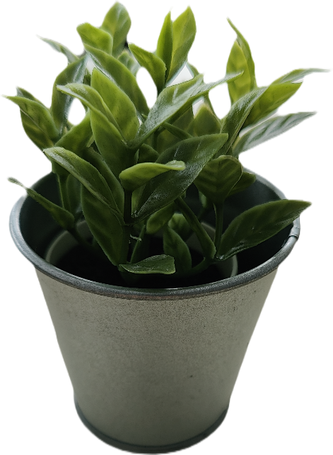
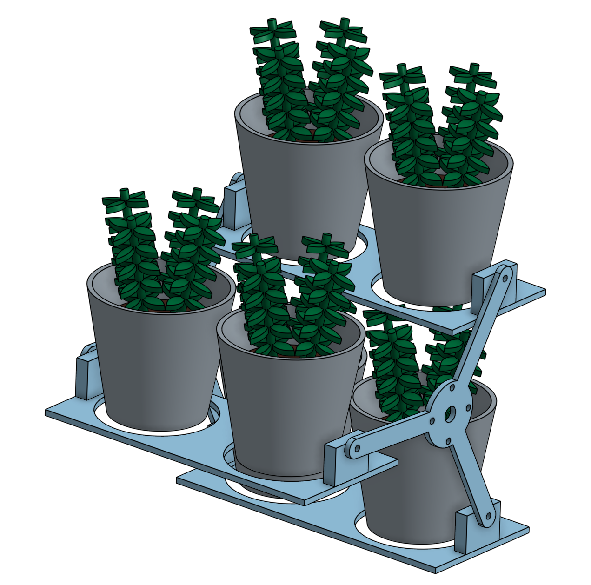
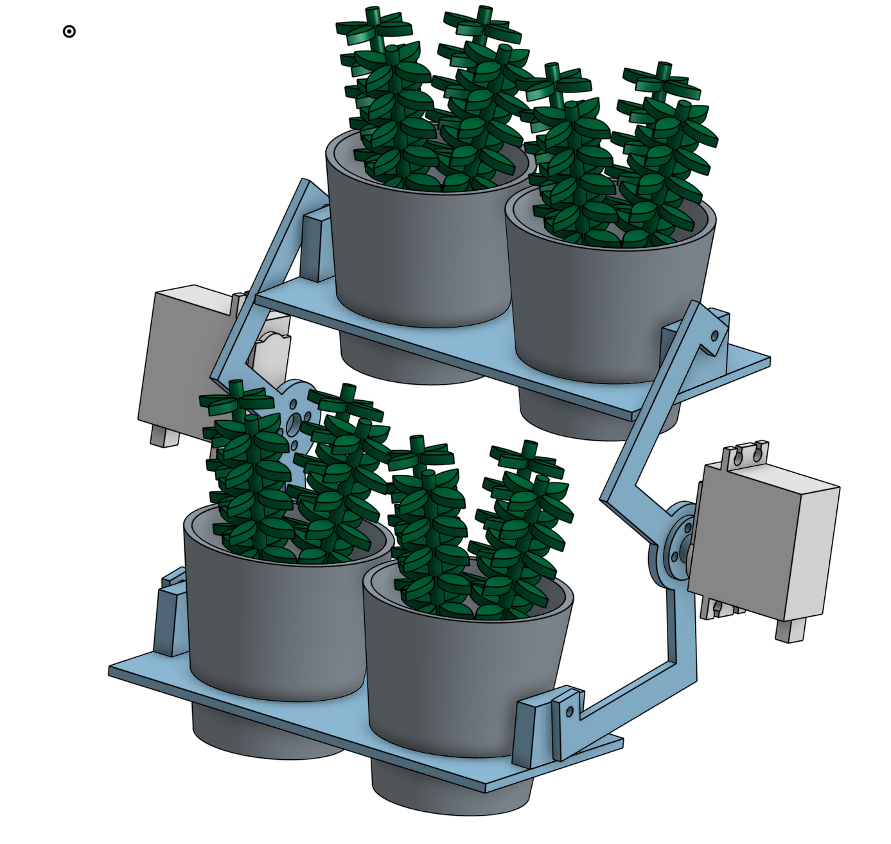
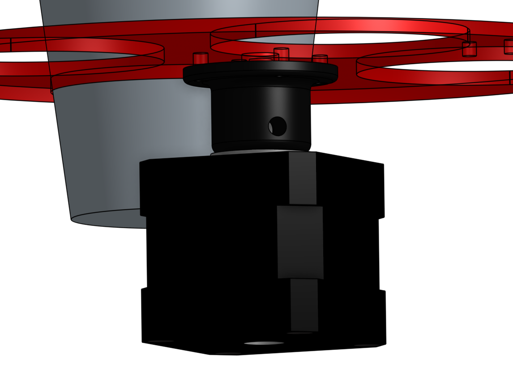
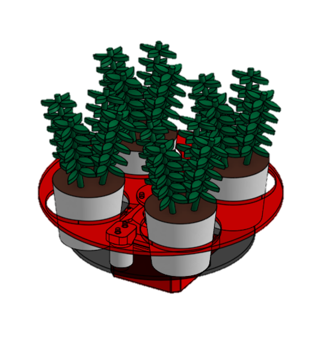
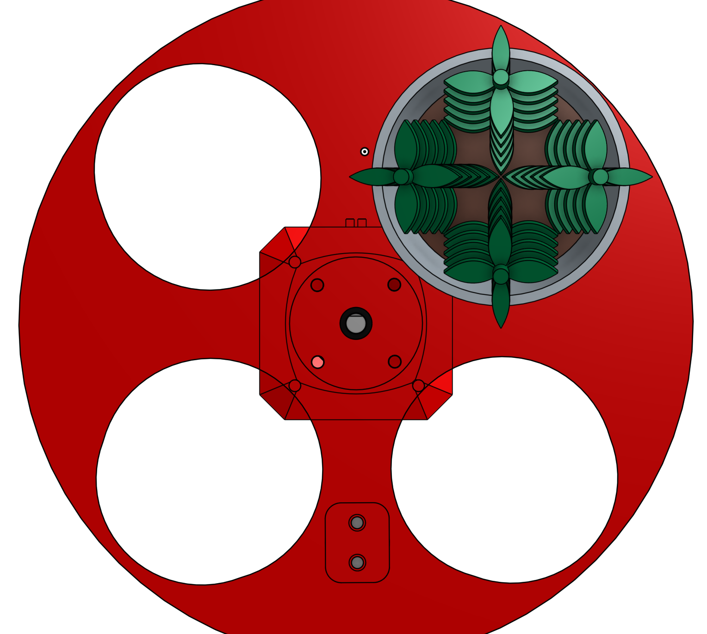
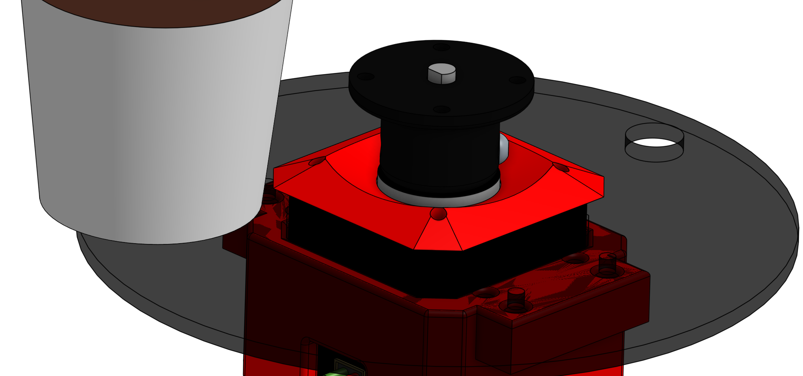
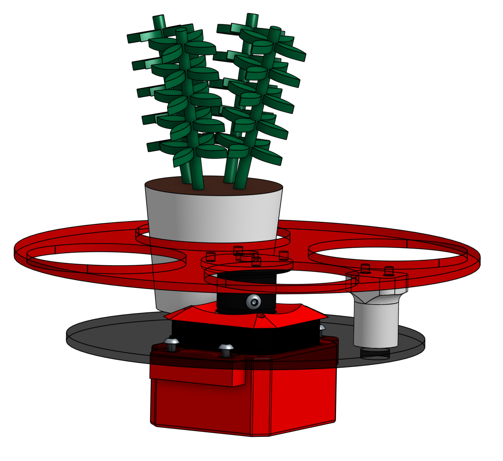

# Objectifs du système

L'objectif du barillet est de stockée les éléments de jeu de la Coupe de France de Robotique 2024. Ces éléments comprennent de petits pots ronds métalliques (environ 6 cm de diamètre et 6,5 cm de hauteur) et des fleurs en plastique légèrement plus petites (de l'ordre de quelque militmètre).

## Aperçu du barrilet et de son rôle

Durant les phases de match, le robot va se déplacer sur le terrain et prendre les pots et les plantes puis les amener à un autre endroit.
Le but étant de stocker les pots et plantes à l'intérieur du robot via le barillet puis de les restituer une fois la zone de dépose atteinte de sorte à limiter les aller retour. Le tout en s'adaptant à la vitesse des pinces.

<video width="640" height="360" controls autoplay muted loop>
  <source src="../../images/barillet/animation_barillet.webm" type="video/webm">
  Votre navigateur ne prend pas en charge la balise vidéo.
</video>

# Spécifications techniques

## Contraintes et exigences spécifiques à la Coupe de France de Robotique 2024

Les exigences spécifiques à la Coupe de France de Robotique portent principalement sur les dimensions du robot et de ses composants embarqués, ainsi que sur la rapidité d'exécution des tâches en raison du temps limité de l'épreuve. Pour respecter la contrainte de taille, le système doit être aussi compact que possible ou optimiser l'espace disponible dans le châssis. De plus, un robot rapide nécessite des moteurs plus puissants, ce qui affecte l'alimentation électrique.Parmi les autres exigences, il y a l'obligation de créer un robot entièrement autonome. Cela implique de surveiller en temps réel la position du barillet et d'automatiser ces mouvements à l'aide d'une carte programmée.

## Exigences de performance

Les performances du barillet vont se remarquer notamment par la vitesse de celui-ci et sa capacité à stocker des pots.
Le barillet doit en effet stocker le plus de pots possible de sorte à gagner du temps sur les aller retour. Dans un même temps il doit s'adapter à la taille du robot qui est très petite ainsi qu'au zone dans lesquelles les pinces peuvent déposer les plantes. il se doit également de pouvoir connaître la position du barillet en permanence pour le placer au bon endroit vis-à-vis des pinces et des emplacements libre. 

# Conception du barillet

## Les différents prototypes 

Pour stocker les éléments de jeu à l'intérieur du robot, deux systèmes ont été imaginés : 

  - Le premier prototype lui se basé sur un axe horizontal autour duquel les éléments de jeu tourné autour. Ce système se rapproche de celui utilisé à l'avant des moissoneuse batteuse.  

  - Le deuxième système reposait sur un axe verticale en rotation autour duquel les éléments de jeu sont placés. 

### Système de stockage à axe horizontal

Ce système permettait de faire tourner les éléments de jeu autour d'un axe horizontal comme le fait l'avant d'une moissonneuse. Grâce à deux emplacements côte à côte pour les éléments de jeu, il aurait été possible de faire passer entre six et huit plantes/pots. 

Plusieurs prototype de ce système ont été fait. Le premier avait quatres emplacement de stockage. Hors la place était très limitée et le système aurait été difficilement adaptable au robot vis à vis de la place à l'intérieur de celui-ci. Il aurait nécéssaire d'agrandir le chassis qui avait des dimensions à respecter. 

Le deuxième comportait trois branches et pouvait rentrer dans le robot. Lors des test il a été constater que les axes permettant le mouvement des espaces de stockage ne permettait pas à la pince de placer les éléments de jeu à leur emplacements dédiés. Pour cela une troisième version à été faites cette fois-ci avec deux branches mais celle ci était d'une forme tel à ne pas gener les machoires des pinces. 

Pour la rotation du mécanisme, il aurait été possible d'utiliser un stepper tout comme un servo moteur. Les deux possibilité aurait été valable. L'avantage du servo moteur été ça petite taille par rapport au stepper ainsi que ca facilité d'utilisation. 
Le stepper aurait été plus gros et avait moins de puissance que le servo moteurs mais permettait de faire des tours à l'infinie.  
Néanmoins ce sytème nécéssitait d'avoir soit un axe reliant les deux coté du rabatteur soit d'avoir un deuxième moteur pour éviter que les pièces en mouvements se bloque entre elles. L'utilisation d'un axe aurait nécéssitait d'agrandir le système ce qui n'était pas possible dans notre cas. Il aurait donc été nécéssaire d'utiliser deux moteurs. Quand bien même deux moteurs auraientt été utilisés, le système restait peu fiable. C'est pourquoi il à été choisie de garder le barillet avec un axe vertical.  

### Système de stockage à axe vertical

Comme mentionné précédemment, ce prototype reposait sur un axe horizontal autour duquel les éléments de jeu auraient tourné. Idéalement, ce prototype aurait comporté deux à trois étages, en fonction de l'espace disponible sur le robot. Les éléments de jeu auraient été déposés successivement au premier, au deuxième, puis au troisième étage afin de maximiser la capacité de stockage.

Cependant, les tests ont démontré l'impossibilité d'inclure plusieurs étages en raison des dimensions du châssis, du positionnement des autres composants du robot et des pinces déjà construites. Par conséquent, il a été décidé de limiter le stockage des éléments de jeu à un seul étage. Pour compenser le manque d'étages, la possibilité de disposer le maximum de pots autour de l'axe a été étudiée. Celons les espacements théorique sur les logiciels de conception, il a été déterminé que le nombre maximal de pots se situait entre quatre et six.

Les tests effectués en association avec la pince ont révélé que le nombre maximum de pots réalisable était de quatre. Bien qu'il soit théoriquement possible d'en placer six, des imprécisions dans le système de pince ont rendu cette configuration impraticable. En effet, la dépose des éléments de jeu n'était jamais parfaitement répétable en raison des déformations des mâchoires en TPU, qui variaient selon la position du pot lors de sa saisie. Par conséquent, il a été nécessaire d'élargir la zone de dépôt des pots, laquelle a été rendue ovale afin de compenser les imprécisions sur un seul axe.

La rotation du système se fait à l'aide d'un stepper qui permet de connaître en temps réel la position de celui-ci, en supposant qu'aucun pas n'a été sauté et que la position de départ été connu. Il aurait également été possible d'utiliser un servo moteur a 360° mais ce type de moteur n'était pas dans le stock de l'association a contrario du stepper.

Le fonctionnement est alors simple, un moteur pas a pas fait tourner une platine sur laquelle sont déposé les pots. Une fois un élément de jeu déposé/pris, le moteur tourne pour laisser l'accès à l'emplacement suivant. 

Un spaceur vient permettre la liaison entre le moteur et la platine en la surelevant dans un même temps. Cela permet aux éléments de jeu de ne pas toucher le moteur.   

#### Prototype N°1 

 Lors des premiers essaies, le stepper qui avait été utlissé en premier lieu (nema 17 PANCAKE) à été remplacer car il manquait de puissance. Le stepper à été remplacer par un nema 17 plus puissant est également disponible au seins de l'association. Ce changement de taille n'était pas un problème car la différence entre les deux était assez faible. De plus l'utilisation d'un unique étage pour le stockage permettait de libérer de la place en hauteur.  

#### Prototype N°2

Ce prototype repose donc sur un nouveau moteur plus gros. Sur cette version, le spaceur à été rendu plus petit et l'emplacement des éléments de jeu à été retrecie de sorte à pouvoir accueillir des plantes en plastique ainsi que des pots métaliques. 

#### Prototype N°3

Finalement sur le système finale la platine a été fermé de sorte à éviter que les éléments à l'intérieur ne soient éjectés lors de la rotation. La forme d'acceuil des éléments de jeu est devenue ovale et à encore été élargie pour permettre plus de flexibilité lors de la dépose des éléments.  Une deuxième platine à été ajouté en dessous pour y poser les éléments de jeu, ceux-ci ne sont désormais plus maintenue par la platine supérieur. 
Par la même occasion une petite cales à été ajouteé pour guider les éléments de je lors de leurs dépose dans le barillet et éviter qu'ils ne soient mal placés. 

Un capteur à également été ajouté pour obtenir une postion de référence et avoir cette même position à chaque initialisation du robot. Pour cela un simple aimant à été placé sur la platine, lorsque celui-ci passe devant le capteur, la position de référence est atteinte.  

# Tests et validation

Finalement le système avec un axe horizontal à été choisie. Avant d'avoir un système fiable en association avec la pince, il a fallut faire de nombreux essaie de sorte à avoir la taille parfaite des emplacements pour les éléments de jeu. Il à également était nécéssaire de programmer la position de référence grâce au capteur. Le capteur détecter la présence de l'aimant avant que celui-ci ne soit au centre, une correction en terme de rotation à donc été ajouté pour corriger ce manque. 

## Résultats 

<video width="640" height="360" controls autoplay muted loop>
  <source src="../../images/pince/fonc_pince.webm" type="video/webm">
  Votre navigateur ne prend pas en charge la balise vidéo.
</video>

## Perspectives pour l'avenir

Pour améliorer ce système, il faudrait ajouté un étage de sorte à stockée plus de pot. Pour cela le système ne subirait pas de gros changement, les plus gros changement serait à effectuer sur le chassis ainsi que sur la pince pour gagner de la place en hauteur. Gagner de la place en hauteur est tout à fait possible car la hauteur du chassis est très largement inférieur au maximum autorisé par le reglement. Cela n'avait pas été fait du à la taille des makerbeam disponible au seins de l'association. 
En somme, peu d'amélioration peuvent être apportées à ce système. 