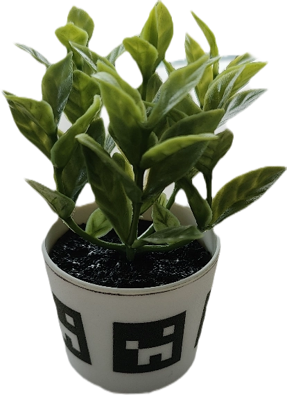
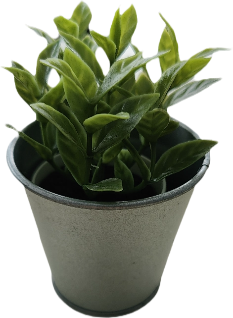
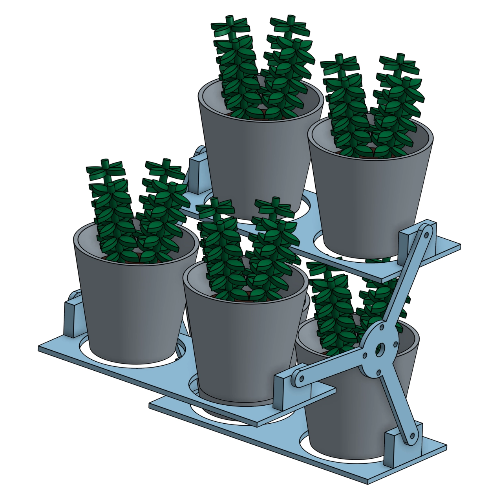
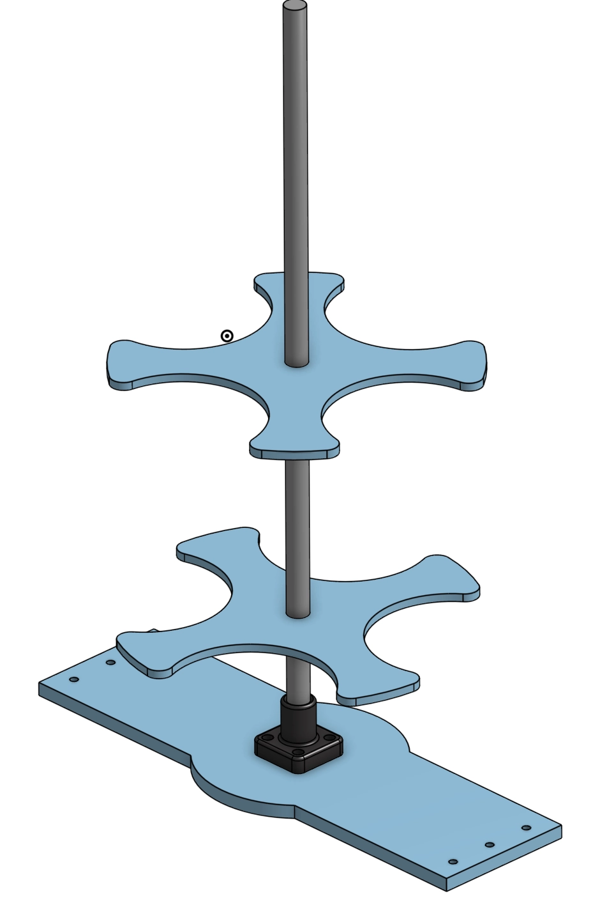
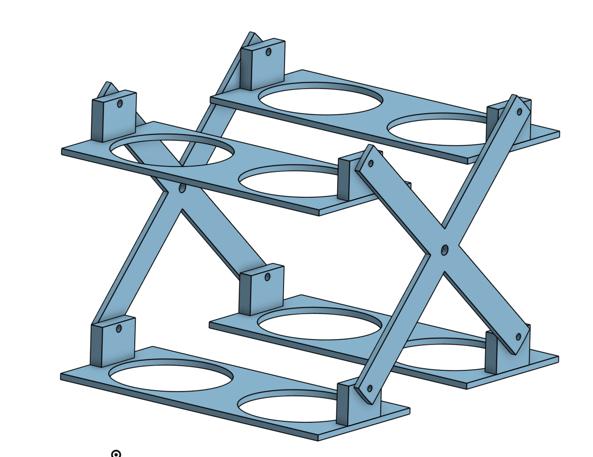
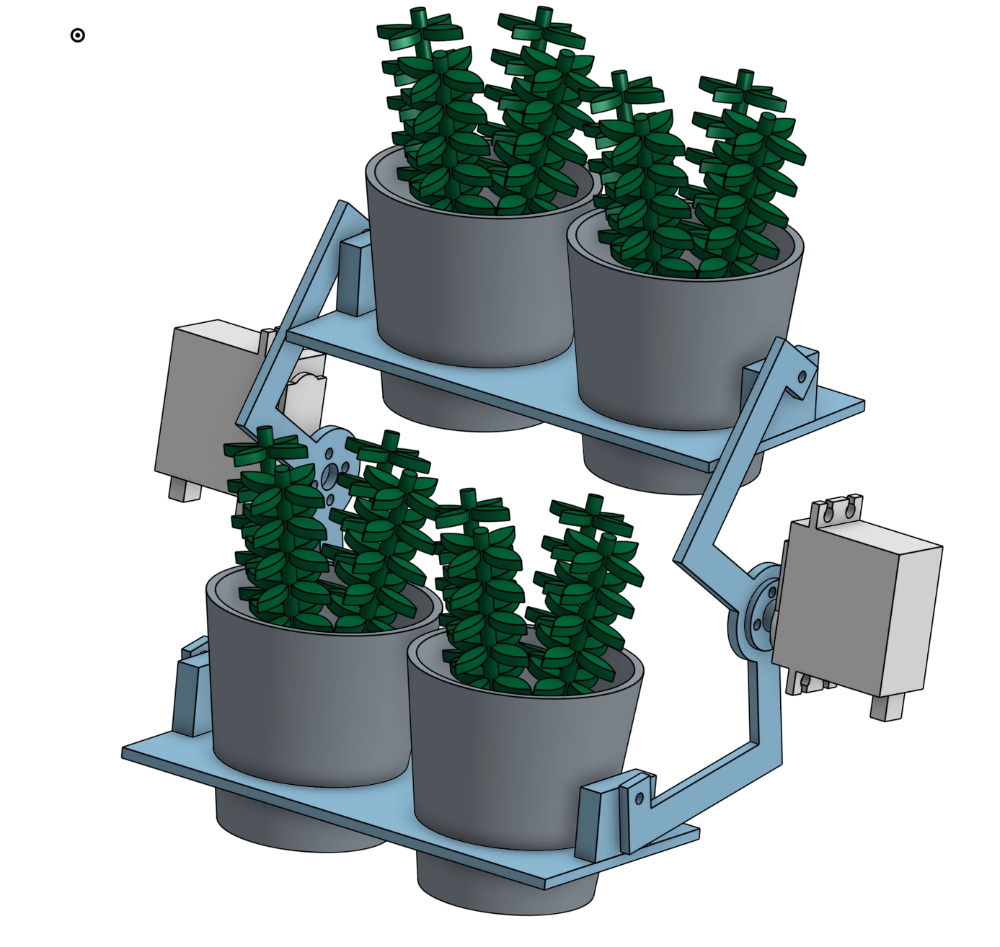
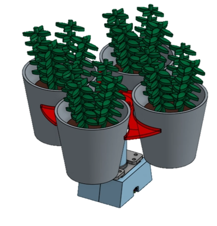
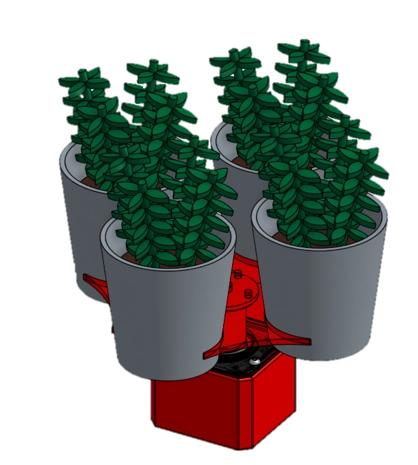
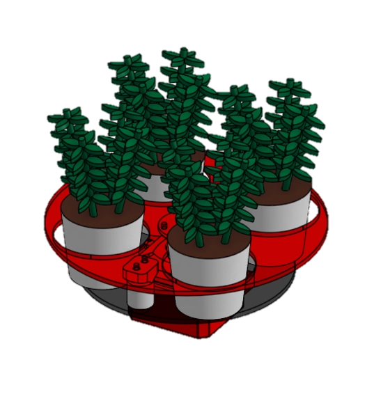
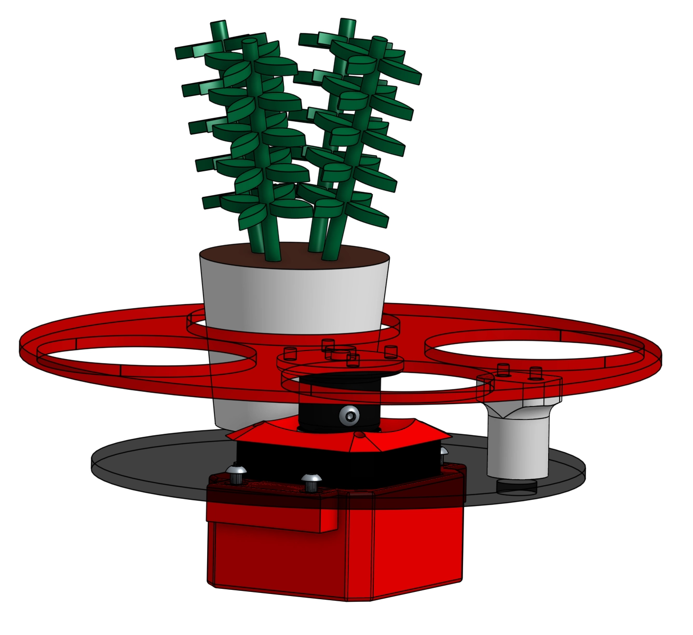

# Objectifs du système

L'objectif du barillet est de stockée les éléments de jeu de la Coupe de France de Robotique 2024. Ces éléments comprennent de petits pots ronds métalliques (environ 6 cm de diamètre et 6,5 cm de hauteur) et des fleurs en plastique légèrement plus petites (de l'ordre de quelque militmètre).

## Aperçu du barrilet et de son rôle

Durant les phases de match, le robot va se déplacer sur le terrain et prendre les pots et les plantes puis les amener à un autre endroit.
Le but étant de stocker les pots et plantes à l'intérieur du robot via le barillet puis de les restituer une fois la zone de dépose atteinte de sorte à limiter les aller retour. Le tout en s'adaptant à la vitesse des pinces.

<video muted autoplay loop><source src="../../images/barillet/animation_barillet.webm" type="video/webm" /></video>

# Spécifications techniques

## Contraintes et exigences spécifiques à la Coupe de France de Robotique 2024

Les exigences spécifiques à la Coupe de France de Robotique 2024 concernent principalement les dimensions du robot et de ses composants embarqués, ainsi que la rapidité d'exécution des tâches en raison du temps limité de l'épreuve. Pour respecter la contrainte de taille, le système doit être aussi compact que possible et optimiser l'espace disponible dans le châssis. De plus, un robot rapide nécessite des moteurs plus puissants, ce qui affecte l'alimentation électrique. Parmi les autres exigences, il y a l'obligation de créer un robot entièrement autonome. Cela implique de surveiller en temps réel la position du barillet et d'automatiser ses mouvements à l'aide d'une carte programmée.

## Exigences de performance

Les performances du barillet sont principalement évaluées par sa vitesse et sa capacité à stocker des pots. Le barillet doit en effet stocker le plus de pots possible afin de minimiser les allers-retours. Parallèlement, il doit s'adapter à la taille restreinte du robot et aux zones où les pinces peuvent déposer les plantes. Il doit également être capable de connaître en permanence la position du barillet pour le placer correctement par rapport aux pinces et aux emplacements libres.

# Conception du barillet

## Les différents prototypes 

Pour stocker les éléments de jeu à l'intérieur du robot, deux systèmes ont été imaginés :

  - *Le premier prototype* est basé sur un axe horizontal autour duquel les éléments de jeu tournent. Ce système est similaire à celui utilisé à l'avant des moissonneuses-batteuses.

  - *Le deuxième* système repose sur un axe verticale en rotation autour duquel les éléments de jeu sont placés. 

La rotation du système est assurée par un moteur pas à pas (stepper) qui permet de connaître en temps réel la position de l'axe, à condition qu'aucun pas n'ait été sauté et que la position de départ soit connue. Bien qu'il aurait été possible d'utiliser un servomoteur à 360°, ce type de moteur n'était pas disponible dans le stock de l'association, contrairement au moteur pas à pas.

Le fonctionnement du système est simple : un moteur pas à pas fait tourner une platine sur laquelle sont déposés les pots. Une fois qu'un élément de jeu est déposé ou pris, le moteur tourne pour permettre l'accès à l'emplacement suivant.

## Système de stockage à axe horizontal

Ce système permet de faire tourner les éléments de jeu autour d'un axe horizontal, similaire au fonctionnement de l'avant d'une moissonneuse. Avec deux emplacements côte à côte pour les éléments de jeu, il aurait été possible de faire passer entre six et huit plantes/pots.

Plusieurs prototypes de ce système ont été réalisés. Le premier prototype comportait quatre emplacements de stockage. Cependant, l'espace disponible étant très limité, le système aurait été difficilement adaptable au robot en raison des contraintes d'espace à l'intérieur de celui-ci. Il aurait été nécessaire d'agrandir le châssis, ce qui aurait été incompatible avec les dimensions requises.

Le deuxième prototype comportait trois branches et pouvait s'intégrer dans le robot. Cependant, lors des tests, il a été constaté que les axes permettant le mouvement des espaces de stockage ne permettaient pas à la pince de placer les éléments de jeu à leurs emplacements dédiés. Pour remédier à ce problème, une troisième version a été conçue avec deux branches, dont la forme était optimisée pour ne pas gêner les mâchoires des pinces.

Pour la rotation du mécanisme, l'utilisation d'un moteur pas à pas ou d'un servomoteur était envisageable. Les deux options étaient valables. Le servomoteur présentait l'avantage d'être plus compact et plus facile à utiliser par rapport au moteur pas à pas. Cependant, bien que le moteur pas à pas soit plus volumineux et moins puissant que le servomoteur, il permettait une rotation infinie.

Néanmoins, ce système nécessitait soit un axe reliant les deux côtés du rabatteur, soit un deuxième moteur pour éviter que les pièces en mouvement ne se bloquent entre elles. L'utilisation d'un axe aurait nécessité un agrandissement du système, ce qui n'était pas envisageable dans notre cas. Par conséquent, il aurait été nécessaire d'utiliser deux moteurs. Cependant, même avec deux moteurs, le système restait peu fiable. C'est pourquoi il a été décidé de conserver le barillet avec un axe vertical.

## Système de stockage à axe vertical

Comme mentionné précédemment, ce prototype reposait sur un axe horizontal autour duquel les éléments de jeu auraient tourné. Idéalement, ce prototype aurait comporté deux à trois étages, en fonction de l'espace disponible sur le robot. Les éléments de jeu auraient été déposés successivement au premier, au deuxième, puis au troisième étage afin de maximiser la capacité de stockage.

Cependant, les tests ont démontré l'impossibilité d'inclure plusieurs étages en raison des dimensions du châssis, du positionnement des autres composants du robot et des pinces déjà construites. Par conséquent, il a été décidé de limiter le stockage des éléments de jeu à un seul étage. Pour compenser le manque d'étages, la possibilité de disposer le maximum de pots autour de l'axe a été étudiée. Selon les espacements théoriques sur les logiciels de conception, il a été déterminé que le nombre maximal de pots se situait entre quatre et six.

Les essais effectués en association avec la pince ont révélé que le nombre maximum de pots réalisable était de quatre. Bien qu'il soit théoriquement possible d'en placer six, des imprécisions dans le système de pince ont rendu cette configuration impraticable. En effet, la dépose des éléments de jeu n'était jamais parfaitement répétable en raison des déformations des mâchoires en TPU, qui variaient selon la position du pot lors de sa saisie.

Un espaceur permet la liaison entre le moteur et la platine en la surélevant simultanément. Cela empêche les éléments de jeu d'entrer en contact avec le moteur.

### <ins>***Prototype N°1 :*** </ins>

Lors des premiers essais, le moteur pas à pas initialement utilisé (NEMA 17 PANCAKE : 17HS086-1004S) a été remplacé en raison de sa puissance insuffisante. Il a été substitué par un moteur pas à pas NEMA 17 plus puissant, également disponible au sein de l'association. Ce changement de taille n'a pas posé de problème, car la différence entre les deux moteurs était minime. De plus, l'utilisation d'un unique étage pour le stockage a permis de libérer de l'espace en hauteur.

Pour plus d'information concernant les moteurs pas à pas, il est possible de consulter la page dédiés au hardware : [moteur pas-à-pas](../Hardware/Hardware.html)

autrement vous pouvez retrouver la documentation technique des moteurs pas à pas ici : 

[NEMA 17 PANCAKE](https://www.omc-stepperonline.com/download/17HS08-1004S.pdf)

[NEMA 17](https://www.omc-stepperonline.com/download/17HS16-2004S1.pdf)

### <ins>***Prototype N°2 :***</ins>

Ce prototype repose donc sur un nouveau moteur plus imposant. Dans cette version, le spacer a été réduit en taille et l'emplacement des éléments de jeu a été resserré pour pouvoir accueillir à la fois des plantes en plastique et des pots métalliques.

### <ins>***Prototype N°3 :***</ins>

Finalement, sur le système final, la platine a été fermée afin d'empêcher l'éjection des éléments lors de la rotation. La forme d'accueil des éléments de jeu est devenue ovale et a été élargie pour offrir plus de flexibilité lors de la dépose des éléments. Une deuxième platine a été ajoutée en dessous pour soutenir les éléments de jeu, ceux-ci n'étant plus maintenus par la platine supérieure.

De plus, une petite cale a été ajoutée pour guider les éléments de jeu lors de leur dépose dans le barillet, évitant ainsi qu'ils ne soient mal placés.

Un capteur a également été ajouté pour obtenir une position de référence et la maintenir à chaque initialisation du robot. Pour ce faire, un simple aimant a été positionné sur la platine. Lorsque celui-ci passe devant le capteur, la position de référence est atteinte.

# Tests et validation

Finalement le système avec un axe horizontal à été choisie. Avant d'avoir un système fiable en association avec la pince, il a fallu faire de nombreux essaie de sorte à avoir la taille parfaite des emplacements pour les éléments de jeu. Il à également était nécessaire de programmer la position de référence grâce au capteur. Le capteur détecter la présence de l'aimant avant que celui-ci ne soit au centre, une correction en terme de rotation à donc été ajouté pour corriger ce manque. 

## Résultats 

<video muted autoplay loop><source src="../../images/pince/fonc_pince.webm" type="video/webm" /></video>

Lors de la compétition, le barillet a pu garantir une fiabilité irréprochable dans les actions qu'il devait effectuer. Aucune modification n'a dû être apportée une fois sur place et aucun composant n'a posé de problème.

## Perspectives pour l'avenir

Pour améliorer ce système, il pourrait être envisageable d'ajouter un étage de sorte à stockée plus de pot. Pour cela le système ne subirait pas de gros changement, les plus gros changement serait à effectuer sur le chassis ainsi que sur la pince pour gagner de la place en hauteur. Gagner de la place en hauteur est tout à fait possible car la hauteur du chassis est très largement inférieur au maximum autorisé par le reglement. Cela n'avait pas été fait dues à la taille des makerbeam disponible au seins de l'association. 
