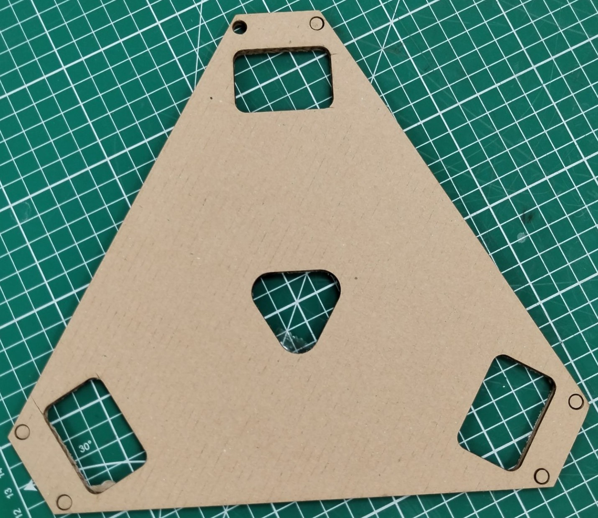
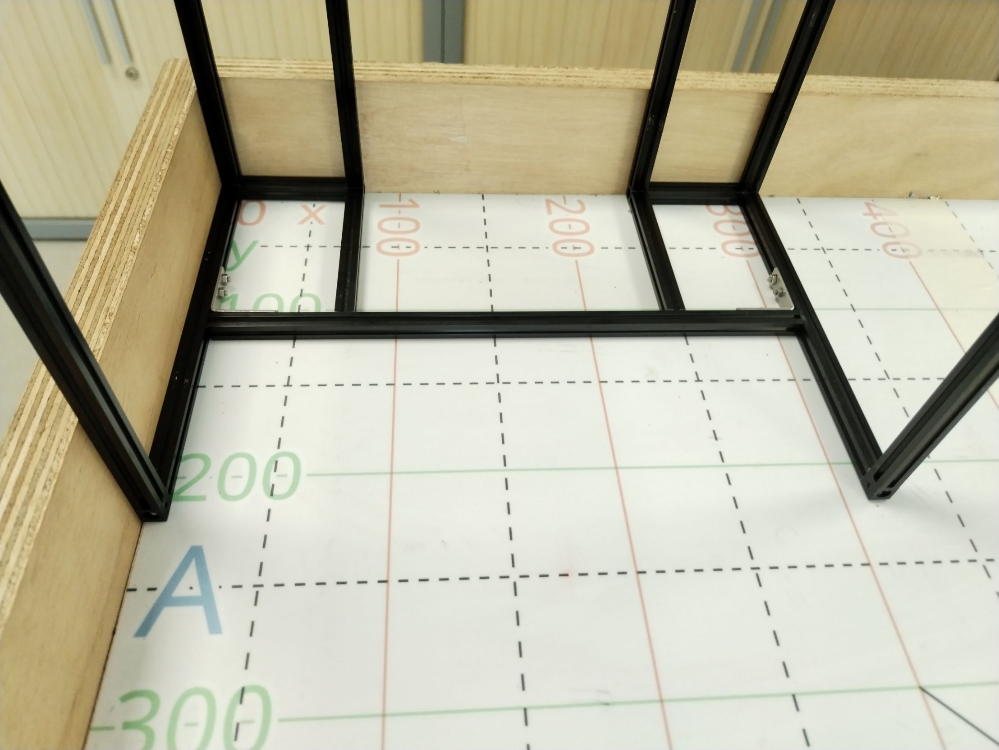
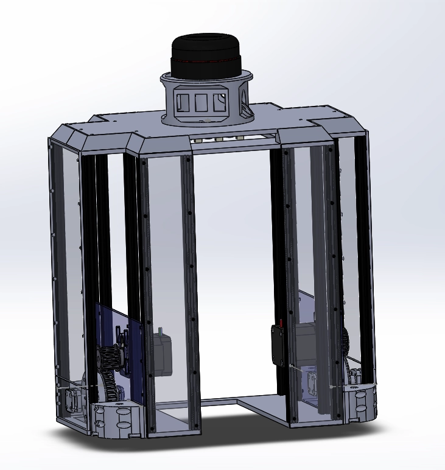
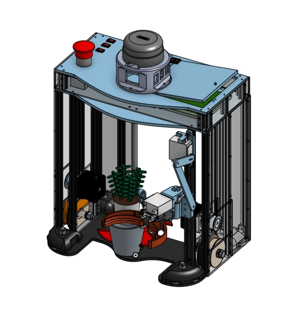
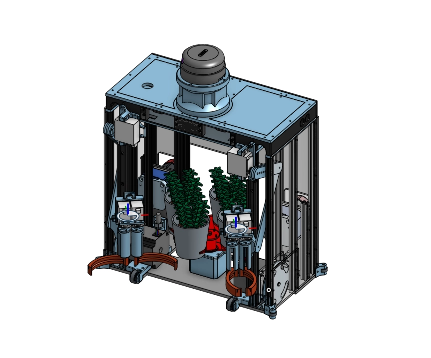

# Le prototypage du robot

Le premier prototype utilisait une base roulante holonome pour permettre au robot de se mouvoir dans toutes les directions, avec un châssis triangulaire et des extrémités modulables.

*(cf : V1 modulable 3D).*

Suite à divers tests, une base roulante en transmission différentielle a été choisie pour optimiser l'espace de stockage des plantes en utilisant deux moteurs.

## Optimisation de la forme et de l'espace de stockage

Un prototype a été développé pour respecter le périmètre maximal de 1200 mm lorsque les actionneurs sont rétractés. Le robot devait avoir un centre creux pour stocker les plantes et les pots, pouvant accueillir 3 pots alignés.

*(cf : V2 arc de triomphe).*

Le châssis de cette version était constitué de Makerbeam et équipé de moteurs Nema 17 et de roues.

## Symétrie pour une meilleure stabilité

La troisième version du châssis présente une symétrie avec un espace central traversant. Un carter a été créé pour loger la carte électronique, la batterie, les boutons et le bouton d'arrêt d'urgence. Des billes folles ont été installées aux quatre coins du robot pour stabiliser les déplacements, car les roues étant placées au centre provoquaient un basculement avant-arrière. Les supports des billes folles peuvent également accueillir des roulements pour ne pas endommager la table.

*(cf : 3D V3).*

#### <ins>Réorganisation Interne :</ins>  
La batterie a été déplacée à l'arrière, libérant de l'espace pour une carte électronique plus grande. Cette réorganisation a optimisé l'utilisation de l'espace et amélioré la performance du robot.

En résumé, le passage à OnShape a permis de surmonter les limitations de Solidworks, d'améliorer la collaboration et de redévelopper le robot de manière plus efficace et fonctionnelle.

*(cf : 3D V4)*

### <ins>Prototype fonctionnel avec Nema 23</ins>

Les tests ont révélé que les moteurs Nema 17 étaient insuffisants. Les moteurs Nema 23 en transmission directe ont été adoptés. Les roulements à l'avant ont remplacé les billes folles pour stabiliser le robot et optimiser l'espace de stockage.

Le robot fonctionne maintenant en 24V avec deux batteries placées à l'arrière. Le carter repose sur quatre pièces imprimées en 3D accueillant l'électro-aimant pour la tirette, un connecteur pour l'alimentation, une prise USB pour l'ESP32 et divers boutons.

*(cf : 3D V5)*

### <ins>Version finale</ins>

La version finale respecte une charte visuelle définissant les couleurs : l'acrylique est noir ou gris fumé transparent et les pièces imprimées en 3D sont rouges. Les actionneurs, les pinces et le barillet ont été finalisés. Des poignées ont été ajoutées pour faciliter le transport, et les roues ont été modifiées pour s'incruster dans des roulements fixés

 dans la plaque d'acrylique. Des roulements ont été placés aux quatre coins pour protéger la table de jeu, et des cales ont été ajoutées à l'arrière pour limiter les chocs lors des recalages en bordure.

*(cf : 3D VF)*

#### Le carter 

Comme on peut le voir, le carter a également connu plusieurs versions qui dépendaient de la forme du robot. Les premières versions étaient constituées de PLA et de MakerBeam. Suite à différents tests, nous nous sommes rendu compte que l'arrière du robot était vide et que le carter pouvait être déplacé à cet endroit. Cette relocalisation nous a permis de libérer 5 cm en hauteur, ce qui nous a permis d'ajouter des poignées au robot ainsi que d'agrandir le mât de balise.

- Argumentation :

  - Évolution du Design : Le carter a subi plusieurs itérations pour s'adapter à la forme et aux besoins fonctionnels du robot. Les premiers modèles utilisaient du PLA et des structures MakerBeam pour leur construction. Cette combinaison offrait une bonne rigidité et était facile à modifier pour les premières versions du prototype.

  - Optimisation de l'Espace : En analysant l'espace disponible après différents tests, nous avons constaté que l'arrière du robot n'était pas utilisé efficacement. En déplaçant le carter à l'arrière, nous avons pu utiliser cet espace de manière plus judicieuse.

  - Gain de Hauteur : Le déplacement du carter a libéré 5 cm en hauteur, un gain significatif pour l'optimisation des fonctionnalités du robot. Cette hauteur supplémentaire a permis d'ajouter des poignées, facilitant ainsi la manipulation et le transport du robot.

  -   Amélioration des Fonctions : Grâce à cet espace libéré, nous avons également pu agrandir le mât de balise, améliorant la visibilité et la performance des systèmes de navigation du robot. Cette modification a contribué à une meilleure utilisation des capteurs et des balises, augmentant ainsi la précision et l'efficacité du robot.

En conclusion, ces ajustements ont permis d'optimiser l'espace disponible, d'améliorer la manipulation du robot et d'augmenter la fonctionnalité du mât de balise, rendant le robot plus efficace et plus pratique à utiliser.
