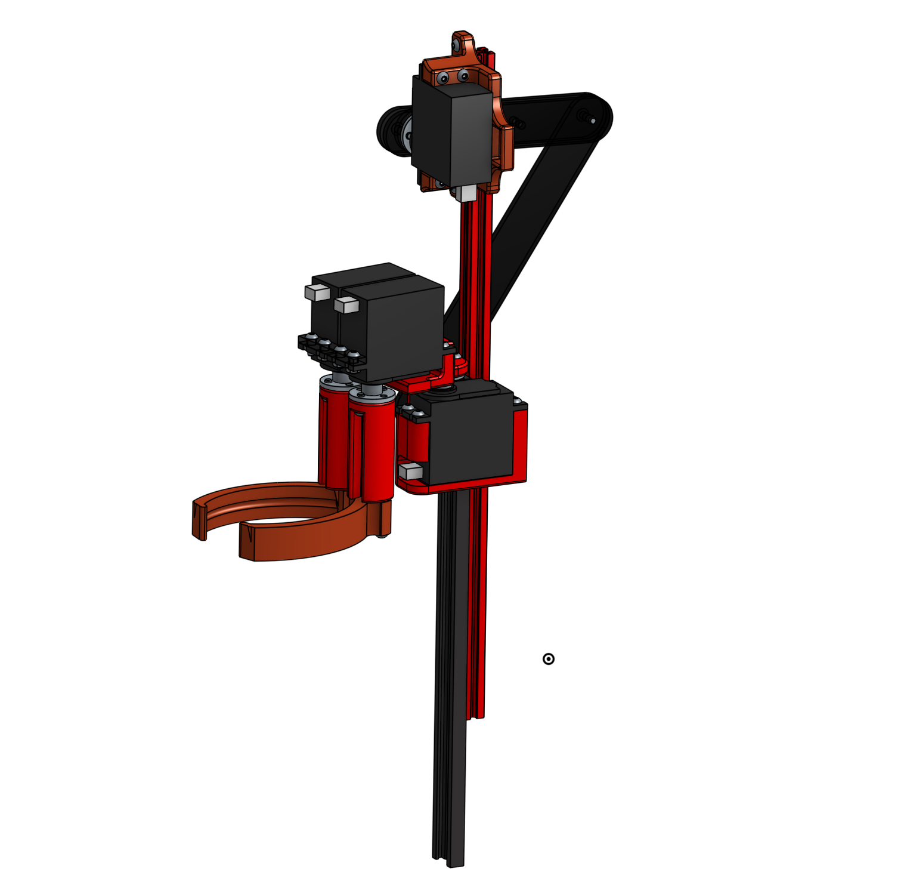
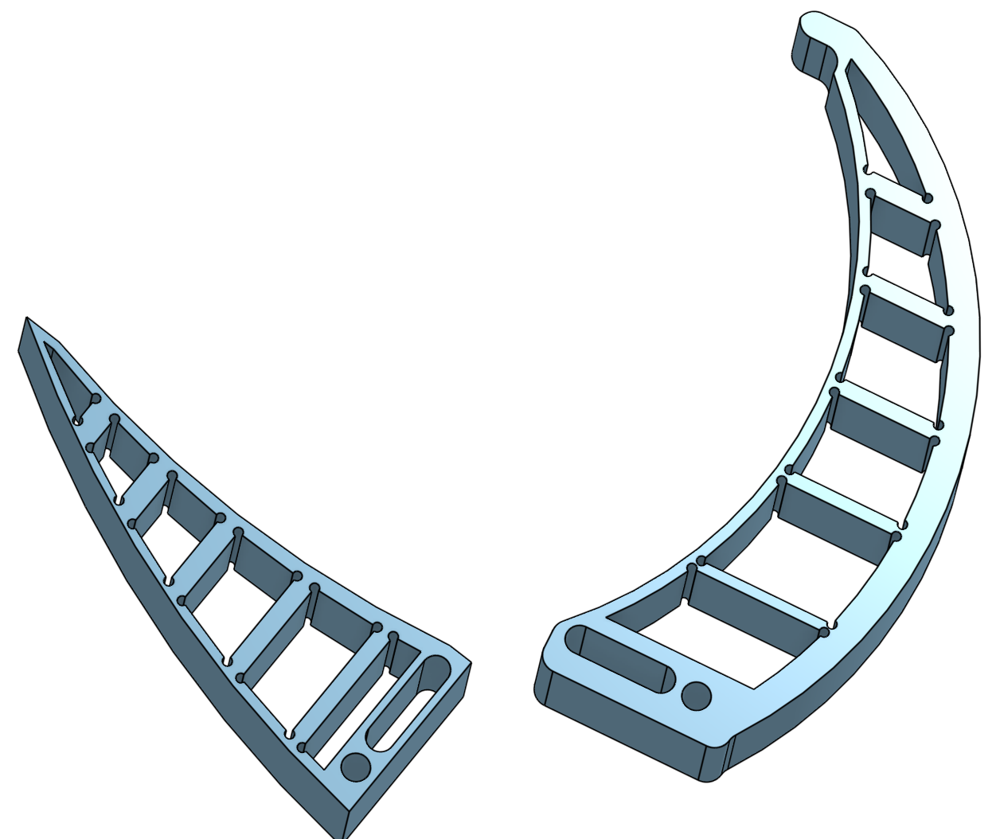
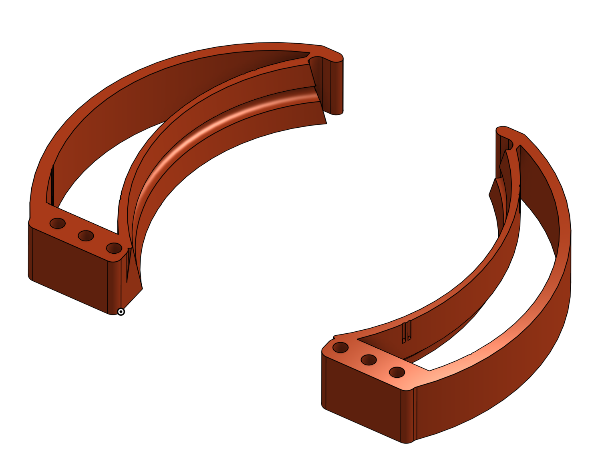
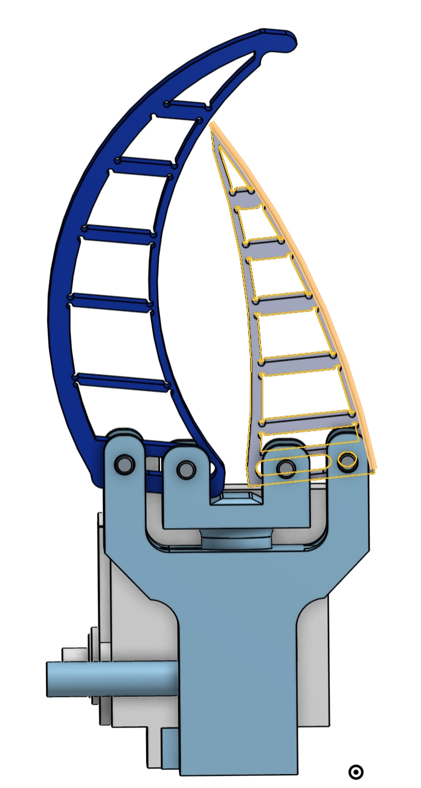
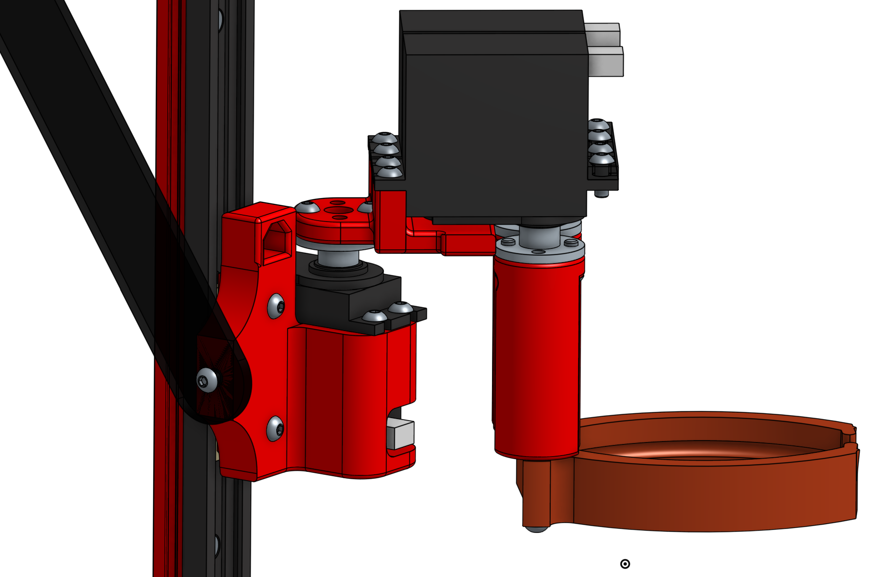

# Objectifs du système

La pince vise à manipuler les éléments de jeu de la Coupe de France de Robotique 2024. Ces éléments de jeu se composent de petits pots ronds métalliques (d'environ 6 cm x 6,5 cm) et de fleurs en plastique légèrement plus petites. De petits panneaux solaires doivent également être manipulés ; ceux-ci doivent uniquement être tournés dans un sens, mais le mécanisme dédié sera détaillé dans une autre section.

Les mâchoires doivent être capables de saisir à la fois les pots en métal et les plantes malgré leurs différences de taille et de poids. Ensuite, ces éléments doivent pouvoir être déplacés pour être pris sur le terrain de jeu puis amenés dans une zone de dépose. La stratégie choisie par l'équipe vise à stocker les éléments de jeu à l'intérieur du robot. Pour ce faire, le système doit être capable de monter ou descendre et de s'orienter dans un angle d'environ 120° par rapport au point de saisie de l'élément. Il est à noter que l'élément sera saisi en face ou sur le côté du robot. En termes de précision, elle doit être suffisante pour positionner les éléments de jeu à quelques millimètres près dans les emplacements dédiés à l'intérieur du robot.Ce système doit également être rapide car le temps est très limité (90 secondes). Plus le système sera rapide, plus le robot pourra marquer de points et aura donc plus de chances de remporter la compétition.

## Aperçu de la pince et de son rôle

Pour répondre à ces objectifs, plusieurs modèles ont été conçus et testés. Ci-dessous, vous trouverez le modèle retenu :

L'objectif de la pince est de pouvoir manipuler les éléments de jeu. Une fois en prise, les mâchoires peuvent se lever avec l'élément de jeu et s'orienter vers l'intérieur du robot pour y déposer les plantes. L'élément de jeu peut alors être stocké dans un barillet, que ce soit une plante ou un pot métallique. Le barillet peut contenir plusieurs éléments de jeu, réduisant ainsi le nombre de manipulations nécessaires.

# Spécifications techniques

## Contraintes et exigences spécifiques à la Coupe de France de Robotique 2024

Les contraintes spécifiques à la Coupe de France de Robotique sont principalement liées à la taille du robot et de ses systèmes embarqués, ainsi qu'à une exécution rapide des tâches en raison de la durée limitée de l'épreuve. Pour mieux répondre à la contrainte de taille, le système doit être le plus compact possible ou exploiter au mieux les espaces disponibles dans le châssis. En revanche, un robot rapide nécessite plus de puissance de la part des moteurs.

Parmi les contraintes de la Coupe, il y a également la nécessité d'avoir un robot entièrement autonome. Cela implique de pouvoir connaître en temps réel la position des moteurs et donc de la pince, ainsi que de pouvoir automatiser ces mouvements via une carte programmée. Le robot doit posséder sa propre source d'alimentation électrique. Étant donné que les objets à manipuler sont très légers et que les pièces mécaniques sont faites en PLA (un matériau assez léger), il n'y a pas d'exigence particulière en termes de puissance des moteurs ; de simples moteurs à charbon seront suffisants. L'utilisation de moteurs à charbon permet de limiter les problèmes liés à des besoins énergétiques élevés sur le mécanisme de pince.

## Exigences de performance

La performance sera principalement jugée par la vitesse du système. Sur le terrain de jeu, il y a 36 pots et 36 plantes répartis sur des zones prédéfinies. Ainsi, pour transporter l'intégralité des pots avec les plantes à l'intérieur, il faut effectuer 72 fois le mouvement pour les stocker et 72 fois pour les vider. En 90 secondes, cela laisse moins d'une seconde pour chaque mouvement de montée/descente du système. Il est clair que le système ne pourra pas répondre à 100 % à cette exigence, notamment si l'on tient compte du temps de déplacement jusqu'aux zones prévues. Cependant, l'objectif serait de s'en rapprocher le plus possible.

En ce qui concerne la précision, seule la rotation autour de l'axe Y doit être précise. La précision sur l'axe Z (la hauteur) importe peu pour le système. De même, les mâchoires n'ont pas besoin d'une forte précision. Leurs matériaux souples et leur forme permettent d'absorber tout défaut de précision.

# Conception du système de pince

### Conception des mâchoires

Le système permettant de manipuler les éléments s'est orienté dès les POC (proof of concept) vers un système de pince afin de pouvoir s'adapter à la fois à la taille des plantes et des pots métalliques. Grâce au TPU, un matériau plus souple et capable de se déformer, permettant à la pince peut s'adapter à n'importe quel objet pour avoir une prise adéquate et éviter de les faire tomber lors des déplacements.

La forme de celles-ci est resté assez similaire au fur et a mesure des versions mais à tout de même subut de nombreux changement. 

La première amélioration apporté à été d'incliner la surface en contact avec les éléments de jeu de sortes à pouvoir mieux épouser la forme de ceux-ci. Une rainure à églament été ajouté de sorte à pouvoir bloquer les éléments de jeu à l'intérieur de celle-ci. En effet, les pots à manipuler oavait une boursouflure sur leur dessus. La pince à égalements été vidé de ses renforts intérieur de sorte à la rendre plus souple. Ce besoin est apparue de par le changement de TPU des imprimantes 3D. Le nouveaux était bien plus rigide, le but était de s'adapter à celui-ci. 

La troisième version consister à rendre les machoires plus fine, car il n'y avait finalement pas l'utilité de garder une forme épaisse comme précédemment. 

Comme l'on peut le voir les machoires se sont affinées au fur et à mesure des essais toujours dans une optique de gains de place. Différentes combinaisons ont égalements permis de trouver la souplesse la plus adéquat. 

Les premières versions avait également la particularité de part leur forme de s'enrouler autour de l'objet lorsque celui ci était serré. 

### Actionneur

Un premier mécanisme permettant le serrage a été longuement travaillé avant le modèle final. Celui-ci avait la particularité de n'avoir qu'un seul moteur pour les mâchoires. Le moteur tirait sur un axe faisant office de levier pour celles-ci. Cependant, ce système ne permettait pas de contrôler indépendamment chaque mâchoire mais était plus léger car ne nécéssitait qu'un seul moteur. 
En revanche, il nécessitait un grand empattement pour peu de force de serrage du à l'axe sur lequel le moteur agissait. 

<video width="640" height="360"  autoplay muted loop>
  <source src="../../images\pince/video1_actionneur1.webm" type="video/webm">
  Votre navigateur ne prend pas en charge la balise vidéo.
</video>

<video width="640" height="360"  autoplay muted loop>
  <source src="../../images/pince/video2_actionneur1.webm" type="video/webm">
  Votre navigateur ne prend pas en charge la balise vidéo.
</video>

Ensuite, un deuxième moteur a été introduit pour les mâchoires, ce qui a grandement simplifié le système et accru la force de serrage. Il y avait désormas le moteur branché en direct sur la machoire. 
En revanche, le système est devenu beaucoup plus lourd du au rajout d'un moteur, ils se sont dans un même temps rapprochés des éléments de jeu, créant ainsi un contact entre les deux. 

Ce contact empêchait de pouvoir manipuler correctement les objets du terrain. Pour éviter cela, des entretoises ont été ajoutées pour abaisser les mâchoires par rapport aux moteurs. Cela a permis de placer le système au-dessus du moteur permettant la rotation, réduisant ainsi grandement l'empattement à l'intérieur du robot.

<video width="640" height="360"  autoplay muted loop>
  <source src="../../images/pince/MOUVEMENT MACHOIRE.webm" type="video/webm">
  Votre navigateur ne prend pas en charge la balise vidéo.
</video>

### Conception de l'ascenseur

Le système d'ascenseur a été choisi parmi deux mécanismes différents. Le premier consistait à utiliser une tige filetée que l'on aurait fait tourner à l'aide d'un moteur brushless. Les positions haute et basse auraient été déterminées grâce à deux capteurs poussoirs. Ce système présentait néanmoins des inconvénients plus importants que celui choisi actuellement. Parmi ceux-ci, on peut retrouver l'alimentation des moteurs brushless et l'impossibilité de mettre en place plusieurs positions hautes à moins d'utiliser un encodeur, ce qui complexifie grandement la programmation.

Le système permettant aux mâchoires de monter et descendre s'est donc orienté vers un servomoteur et un bras de levier sur un rail linéaire. En tournant, le moteur tire vers le haut le reste du système. La seule évolution de ce système à été de doubler le bras de levier pour le solidifier et d'ajouter de multiples perçages à des fins de test quant à la force du moteur en fonction de la longueur du bras. Ce système présente l'avantage d'être simple à piloter, assez rapide, compact et de ne prendre de la place qu'en hauteur (à l'endroit où se situe le servomoteur), l'espace le moins utilisé sur le robot.

Le rail linéaire est composé de deux éléments, un rail en aluminium et un patin en plastique autolubrifié, les deux viennent s'emboiter pour glisser l'un sur l'autre. Ce produit vient de notre sponsor IGUS. Ce type de produit à la particularité d'avoir peu de perte du au frottement tout en ayant une durée de vie proche de système équivalent entièrement métalique, le tout sans nécéssité de lubrification. 

<video width="640" height="360"  autoplay muted loop>
  <source src="../../images/pince/RAIL LINEAIRE.webm" type="video/webm">
  Votre navigateur ne prend pas en charge la balise vidéo.
</video>

Le système de machoire à alors été fixé sur le patin pour lui permettre de monter et descendre librement. 

Ainsi en fixant le bras de levier, le système devient entièrement controlable sur 3 axes. 

<video width="640" height="360"  autoplay muted loop>
  <source src="../../images/pince/Mouvement rail Igus.webm" type="video/webm">
  Votre navigateur ne prend pas en charge la balise vidéo.
</video>

## Tests et validation

### Procédure de validation

Pour valider le système de pinces, à chaque itération du système, les différentes pièces nécessaires ont été imprimées puis testées dans toutes les situations possibles. Cela a commencé par la reproduction du mouvement ou des effets du mécanisme à la main. Si l'essai était validé, alors un essai était effectué avec les servomoteurs contrôlés via une petite carte et un potentiomètre. Enfin, si les essais précédents étaient concluants, le système était testé avec un programme. Ensuite, les modifications possibles étaient apportées au système, déclenchant à nouveau la procédure de test depuis le début, et ainsi de suite jusqu'à obtenir le système final.

### Résultats

Lors de la compétition, le système a partiellement répondu à son cahier des charges. En effet, il a pu manipuler les plantes avec assez de précision pour les prendre et les déposer aux endroits souhaités. Le système s'est parfaitement comporté avec le barillet et était relativement rapide. En revanche, nous avons constaté que d'autres systèmes étaient beaucoup plus adaptés que le nôtre. Ces autres systèmes avaient la capacité de prendre plusieurs plantes en même temps ; ils étaient certes beaucoup moins précis et auraient abîmé de vraies plantes, mais ils répondaient mieux aux exigences de la compétition.

De plus, lors de la compétition, les températures étaient assez élevées, ce qui a provoqué une déformation majeure des mâchoires en TPU, les rendant moins efficaces qu'à l'origine.

## Perspectives pour l'avenir

Une première amélioration possible serait de remplacer le barillet par deux autres pinces presque identiques à celles actuellement sur le robot. Ainsi, le moteur pour l'orientation vers le barillet n'aurait plus été nécessaire, ce qui aurait fait gagner du temps. Cela permettait dans un même temps de manipuler les plantes par quatre, simplifiant la programmation et améliorant la fiabilité du système. L'utilisation de se système avait également comme avantage de ne pas nécéssité beaucoup de modification à celui actuels n'engagent pas à beaucoups d'investissements en terme de temps passé. 

Dans une perspective d'avenir, il pourrait aussi être envisageable d'utiliser un système de pince permettant de saisir plusieurs éléments de jeu en même temps, de supprimer le barrilet actuels et le remplacer par une deuxième pince équivalentes pour multipié par deux le nombres d'éléments de jeux manipulable avant chaque dépot dans les zones prévue a cet effets. 

