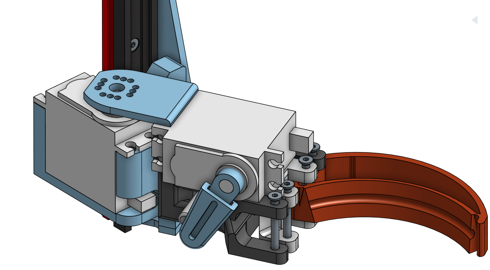

# Objectifs du système

L'objectif de la pince est de manipuler les éléments de jeu de la Coupe de France de Robotique 2024. Ces éléments comprennent de petits pots ronds métalliques (environ 6 cm de diamètre et 6,5 cm de hauteur) et des fleurs en plastique légèrement plus petites. De petits panneaux solaires doivent également être manipulés ; ils doivent uniquement être tournés dans une direction spécifique, mais le mécanisme correspondant sera détaillé dans une autre section dédiés à celui ci.

Les mâchoires doivent être capables de saisir aussi bien les pots métalliques que les plantes, malgré leurs différences de taille et de poids. Ces éléments doivent ensuite être déplacés depuis le terrain de jeu jusqu'à la zone de dépôt. La stratégie choisie par l'équipe consiste à stocker les éléments de jeu à l'intérieur du robot. Pour ce faire, le système doit pouvoir se lever, se baisser et s'orienter à un angle d'environ 120° par rapport au point de saisie de l'élément. Il est important de noter que l'élément peut être saisi en face ou sur le côté du robot. En termes de précision, celle-ci doit être suffisante pour positionner les éléments de jeu à quelques millimètres près dans les emplacements prévus à l'intérieur du robot. Ce système doit également être rapide car le temps est très limité (90 secondes). Plus le système sera rapide, plus le robot pourra marquer de points et ainsi augmenter ses chances de remporter la compétition.

## Aperçu de la pince et de son rôle

Pour répondre à ces objectifs, plusieurs modèles ont été conçus et testés. Ci-dessous, vous trouverez le modèle retenu :

La pince à donc été conçu de sorte à pouvoir manipuler les éléments de jeu. Une fois l'élément saisi, les mâchoires peuvent se lever avec celui-ci et s'orienter vers l'intérieur du robot pour y déposer les plantes. Les éléments de jeu, qu'il s'agisse de plantes ou de pots métalliques, peuvent alors être stockés dans un barillet. Ce barillet est capable de contenir 4 éléments, ce qui réduit le nombre de manipulations nécessaires et optimise ainsi le temps de jeu.

# Spécifications techniques

## Contraintes et exigences spécifiques à la Coupe de France de Robotique 2024

Les contraintes spécifiques à la Coupe de France de Robotique concernent principalement la taille du robot et de ses systèmes embarqués, ainsi que l'exécution rapide des tâches, étant donné la durée limitée de l'épreuve. Afin de répondre à la contrainte de taille, le système doit être le plus compact possible ou optimiser l'utilisation des espaces disponibles dans le châssis. Par ailleurs, un robot rapide requiert une plus grande puissance des moteurs ce qui impact donc l'alimentation.

Parmi les autres contraintes, figure l'obligation de concevoir un robot entièrement autonome. Cela nécessite de connaître en temps réel la position des moteurs, notamment celle de la pince, et de pouvoir automatiser ces mouvements grâce à une carte programmée. Le robot doit également disposer de sa propre source d'alimentation électrique. Ce critère est à prendre en compte car en fonction des technologies utilisées, il sera nécéssaire d'en adapter également l'alimentation. Par chance les élements de jeu à manipuler sont très léger, de l'ordre de quelque grammes par éléments. Cela joue en la faveur d'une consommation d'énergie moindre. 

## Exigences de performance

La performance du système sera principalement évaluée en fonction de sa vitesse. Sur le terrain de jeu, il y a 36 pots et 36 plantes répartis dans des zones prédéfinies. Pour transporter l'intégralité des pots avec les plantes à l'intérieur, il faut effectuer 72 mouvements pour les stocker et 72 mouvements pour les vider. En 90 secondes, cela laisse moins d'une seconde pour chaque mouvement de montée et de descente du système. Il est clair que le système ne pourra pas répondre pleinement à cette exigence, notamment en tenant compte du temps de déplacement jusqu'aux zones prévues. Cependant, l'objectif est de s'en rapprocher le plus possible.

Quant à la précision, seule la rotation autour de l'axe Y doit être précise. La précision sur l'axe Z (la hauteur) est de moindre importance pour le système, une marge d'erreur de plusieurs milimètre est largement tolérable. De même, les mâchoires n'ont pas besoin d'une grande précision. Leur matériau souple (TPU) et leur forme permettent d'absorber les éventuels défauts de précision.

# Conception du système de pince

### Conception des mâchoires

Dès les premières preuves de concept (POC), le système de manipulation des éléments s'est orienté vers un dispositif de pince afin de s'adapter aussi bien à la taille des plantes qu'à celle des pots métalliques. Grâce à l'utilisation du TPU, un matériau souple et déformable, la pince peut s'ajuster à n'importe lequel des objets à manipuler, garantissant ainsi une prise adéquate et empêchant la chute des éléments lors des déplacements.

La forme de la pince est restée relativement constante au fil des versions, mais elle a néanmoins subi de nombreux ajustements. 

La première amélioration apportée a été d'incliner la surface en contact avec les éléments de jeu afin de mieux épouser leur forme. Une rainure a également été ajoutée pour permettre de bloquer les éléments de jeu à l'intérieur de celle-ci grâce à leur forme particulière. En effet, les pots à manipuler présentaient une boursouflure sur leur partie supérieure. De plus, la pince a été allégée en retirant certains de ses renforts intérieurs pour la rendre plus souple. Ce besoin est apparu en raison du changement de TPU utilisé dans les imprimantes 3D. Le nouveau TPU était beaucoup plus rigide, il a été nécessaire d'adapter les machoires pour conserver leur flexibilités.

La troisième version visait à affiner les mâchoires, car il s'est avéré qu'il n'était pas nécessaire de maintenir une épaisseur importante comme dans les versions précédentes. Cette épaisseur permettait de faire épouser la forme de l'éléments à la machoires or lors du retrait des renforts, cette fonction était moins efficace. En effectuant des tests, il a été convenue que cette forme n'était pas obligatoire. Les éléments de jeu étaientt également très bien pris avec la troisèmes forme développés. 

Comme on peut le constater, les mâchoires ont été affinées progressivement au cours des essais, toujours dans le but de gagner de l'espace. Diverses combinaisons ont également été explorées pour trouver le niveau de souplesse le plus adapté.

### Conception des Actionneurs

Un premier mécanisme de serrage a été largement étudié avant d'aboutir au modèle final. Celui-ci se caractérisait par l'utilisation d'un seul moteur pour actionner les mâchoires. Le moteur agissait sur un axe servant de levier pour celles-ci. Cependant, ce système ne permettait pas de contrôler chaque mâchoire indépendamment, mais était plus léger car il nécessitait un seul moteur. En revanche, il présentait un empattement important pour une force de serrage limitée en raison de l'axe sur lequel le moteur agissait.

<video width="640" height="360"  autoplay muted loop>
  <source src="../../images\pince/video1_actionneur1.webm" type="video/webm">
  Votre navigateur ne prend pas en charge la balise vidéo.
</video>

<video width="640" height="360"  autoplay muted loop>
  <source src="../../images/pince/video2_actionneur1.webm" type="video/webm">
  Votre navigateur ne prend pas en charge la balise vidéo.
</video>

Ensuite, un deuxième moteur a été ajouté pour les mâchoires, ce qui a considérablement simplifié le système et augmenté la force de serrage. Désormais, un moteur était directement connecté à chaque mâchoire via le palonnier. Cependant, cette modification a rendu le système beaucoup plus lourd en raison de l'ajout d'un moteur, et les éléments se sont rapprochés les uns des autres, créant ainsi un contact entre eux.

Ce contact entre les éléments a entravé la manipulation correcte des objets sur le terrain. Pour remédier à cela, des entretoises ont été ajoutées pour abaisser les mâchoires par rapport aux moteurs. Cela a permis de positionner le système au-dessus du moteur responsable de la rotation, réduisant ainsi considérablement l'empattement à l'intérieur du robot.

<video width="640" height="360"  autoplay muted loop>
  <source src="../../images/pince/MOUVEMENT MACHOIRE.webm" type="video/webm">
  Votre navigateur ne prend pas en charge la balise vidéo.
</video>

Pour déplacer les plantes jusqu'au barillet, un servo-moteur identique à ceux déjà utilisés a été ajouté. Cette fois également, plusieurs versions ont été étudiées. La première était adaptée au premier mécanisme d'actionneur, qui présentait un effet de levier assez important en raison de l'empattement du mécanisme et nécéssitait en conséquence un renfort au niveau des axes de rotation.

Comme on peut l'observer, le poids du système exercé sur le moteur est réparti sur deux points de fixation, situés au-dessus et en dessous, afin de prévenir tout dommage au moteur.

Suite au remplacement des actionneurs (ajout du deuxième moteur), le mécanisme a été adapté.

Grâce à la proximité des moteurs contrôlant les mâchoires (réduction de l'effet de levier), il n'était plus nécessaire d'ajouter un support supplémentaire. En d'autres termes, les mâchoires ont été directement montées sur le palonnier du moteur permettant la rotation. Le principe de fonctionnement est demeuré inchangé entre les deux versions.
<video width="640" height="360"  autoplay muted loop>
  <source src="../../images/pince/Rotation_actionneur.webm" type="video/webm">
  Votre navigateur ne prend pas en charge la balise vidéo.
</video>

### Conception de l'ascenseur

Le choix du système d'ascenseur s'est fait parmi deux mécanismes distincts. Le premier envisageait l'utilisation d'une tige filetée actionnée par un moteur brushless, avec des capteurs poussoirs déterminant les positions haute et basse. Cependant, ce système présentait des inconvénients majeurs par rapport à celui actuellement retenu. Parmi ceux-ci, on peut citer la complexité de l'alimentation des moteurs brushless et l'incapacité à définir plusieurs positions (d'un point de vue programmation) sans recourir à un encodeur, ce qui aurait considérablement compliqué la programmation.

Ainsi, le mécanisme permettant le déplacement des mâchoires vers le haut et vers le bas a été orienté vers l'utilisation d'un servomoteur et d'un bras de levier montés sur un rail linéaire. Ce dernier se compose de deux éléments : un rail en aluminium et un patin en plastique autolubrifié, s'emboîtant l'un dans l'autre pour permettre un glissement fluide. Ce produit est fourni par notre sponsor IGUS. Sa caractéristique principale est de minimiser les pertes dues aux frottements tout en offrant une durée de vie similaire à celle des systèmes entièrement métalliques, et ce, sans nécessiter de lubrification.

<video width="640" height="360"  autoplay muted loop>
  <source src="../../images/pince/RAIL LINEAIRE.webm" type="video/webm">
  Votre navigateur ne prend pas en charge la balise vidéo.
</video>

Le système de mâchoires a été solidement fixé sur le patin, permettant ainsi un déplacement fluide vers le haut ou vers le bas le long du rail, sans nécessiter l'application d'une force significative.

En effectuant une rotation, le moteur élève le reste du système. L'évolution de ce mécanisme a consisté à doubler la longueur du bras de levier pour renforcer sa structure et à intégrer plusieurs perforations afin de tester la relation entre la force du moteur et la longueur du bras. Ce système présente l'avantage d'être facile à manipuler, relativement rapide, compact et de n'occuper de l'espace qu'en hauteur, à l'emplacement du servomoteur, qui est généralement la zone la moins sollicitée du robot.

Ainsi, en ajoutant le bras de levier, le système devient entièrement contrôlable sur trois axes.

<video width="640" height="360"  autoplay muted loop>
  <source src="../../images/pince/Mouvement rail Igus.webm" type="video/webm">
  Votre navigateur ne prend pas en charge la balise vidéo.
</video>

# Tests et validation

### Procédure de validation

Pour valider le système de pinces, à chaque itération, les différentes pièces nécessaires ont été imprimées puis testées dans toutes les situations possibles. Cela a commencé par la reproduction manuelle des mouvements ou des effets du mécanisme. Si l'essai était validé, un test était ensuite réalisé avec des servomoteurs contrôlés via une petite carte et un potentiomètre. Enfin, si les essais précédents étaient concluants, le système était testé avec un programme. Les modifications éventuelles étaient alors apportées au système, déclenchant à nouveau la procédure de test depuis le début, jusqu'à obtenir le système final.

### Résultats

Voici une vidéo du robot utilisant la pince pour charger et décharger les plantes en plastique ainsi que les pots. Dans cette vidéo, une seule pince est en fonctionnement pour illustrer son mécanisme. La vidéo a également été ralentie afin de mieux observer les différents mouvements. En réalité, lors de la compétition, deux pinces fonctionnaient simultanément pour permettre au robot de manipuler un plus grand nombre d'éléments de jeu en même temps.

<video width="640" height="360" controls autoplay muted loop>
  <source src="../../images/pince/fonc_pince.webm" type="video/webm">
  Votre navigateur ne prend pas en charge la balise vidéo.
</video>

Lors de la compétition, le système a répondu aux exigences du cahier des charges. En effet, il a pu manipuler les plantes avec suffisamment de précision pour les prendre et les déposer aux endroits souhaités. Le système s'est parfaitement comporté avec le barillet et s'est avéré relativement rapide. Cependant, nous avons constaté que d'autres systèmes étaient beaucoup plus adaptés que le nôtre. Ces autres systèmes avaient la particularité de prendre plusieurs plantes en même temps. Bien qu'ils étaient moins précis et auraient endommagé de vraies plantes, ils répondaient mieux aux exigences de la compétition.

De plus, lors de la compétition, les températures élevées ont provoqué une déformation majeure des mâchoires en TPU, les rendant moins efficaces qu'à l'origine.

## Perspectives pour l'avenir

Une première amélioration possible serait de remplacer le barillet par deux autres pinces presque identiques à celles actuellement sur le robot. Cela permettrait de supprimer le moteur d'orientation vers le barillet, ce qui aurait réduit le temps nécessaire pour les actions de jeu. Cela permettrait également de manipuler les plantes par quatre, simplifiant ainsi la programmation et améliorant la fiabilité du système en réduisant le nombre de mouvements à effectuer. L'utilisation de ce système présenterait également l'avantage de nécessiter peu de modifications par rapport au système actuel, sans nécessiter d'investissements importants en termes de temps.

Dans une perspective d'avenir, il serait envisageable d'utiliser un système de pince permettant de saisir plusieurs éléments de jeu en même temps, de supprimer le barillet actuel et de le remplacer par une deuxième pince équivalente pour doubler le nombre d'éléments de jeu manipulables avant chaque dépôt dans les zones prévues à cet effet.

