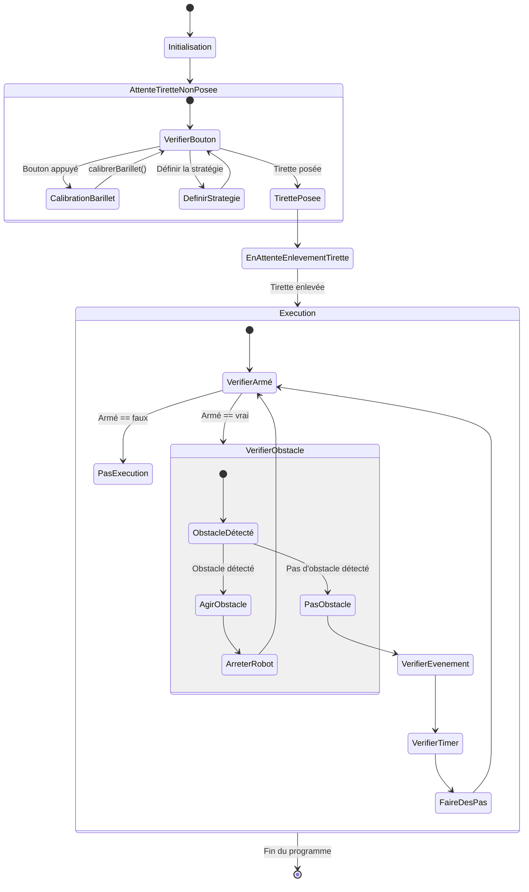

# La Programmation

La programmation du robot s'est faite sous PlatformIO, une extension de VSCode qui permet de faire de la programmation embarquée. Cette extension offre plus de liberté que l'IDE Arduino, en profitant notamment du système de visualisation d'arborescence de VSCode.

## Intialisation

Le démarrage du robot se passe comme suit :

1. Initialisation du port série.
2. Initialisation du protocole LIDAR.
3. Initialisation du protocole I²C.
4. Initialisation des pinces.
5. Initialisation des modes de fonctionnement des GPIOs.
6. Mise à zéro des différentes variables de position.
7. Attente de la pose de la tirette et choix de la zone de travail.
8. Attente de l'enlèvement de la tirette.
9. Démarrage.

# déroulée après départ 

le code étant de consequent, nous allons proceder avec une diagramme d'état simplifiée pour comprendre le fonctionnement du code.

