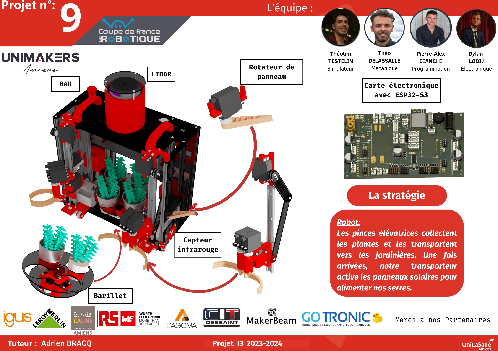

# La documentation de l'équipe I3 pour la Coupe de France de robotique 2024

Bienvenue sur la page du projet de la Coupe de France de robotique. Vous y trouverez les différentes documentations ainsi que les recherches effectuées par l'équipe dans le cadre de la construction d'un robot, tout en itérant les designs.

## À propos du projet

La Coupe de France de robotique est un événement qui a lieu chaque année à La Roche-sur-Yon. De nombreuses équipes de robotique provenant de différentes écoles d'ingénieurs ainsi que de lycées se rendent sur place pendant quatre jours pour mettre au défi leurs robots qu'elles auront conçus au cours des neuf mois précédents.

## Poster & vidéo - robot principal

<!-- Vidéo journée des projets sur le robot principal -->

<video controls><source src="./images/Robot.webm" type="video/webm" /></video>

## Poster & vidéo - PAMI

<!-- Vidéo journée des projets sur le PAMI -->

<video controls><source src="./images/pami-presentation_video.webm" type="video/webm" /></video>

