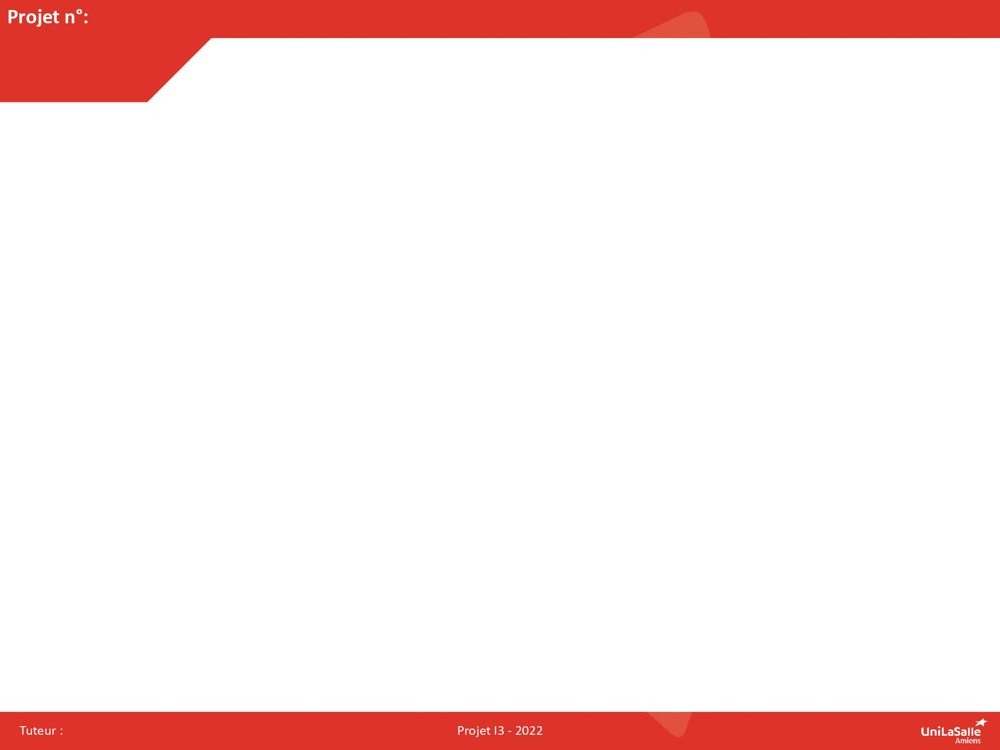

# Les Docs de l'équipe I3 de la coupe de france de robotique 2024

Bienvenue dans la documentation du projet de la coupe de france de robotique. Vous allez y trouver les differents documentations ainsi que recherches que l'équipe a fait lors de la quete de constuire un robot, tout en itterant les designs

## In a nutshell

La coupe de robotique est un événement qui prend lieu chaque année a roche-sur-yon,
de nombreux équipes de robtiques de différentes écoles d'ingénieurs ainsi que de lycées se 
rendent sur le lieu pendant 4 jours pour mettre au défi le robot qu'ils auronts conçue lors de 9 mois préalable 

## Poster

Ici vous publierez le poster de votre projet.

## Vidéo

Ici vous publierez la vidéo de votre projet. 
- Moins de 1min30
- Présentation du projet 
- Des explication du fonctionnement du projet
- Des vues du projet / Prototype / Application etc... 
- Des plans du fonctionnement (même basique ou des éléments séparés)
- Une conclusion
Si en stockage local : x<50mo

<video src="images/intro_amiens.mp4" controls title="Title"  style="width: 100%;"></video>

---