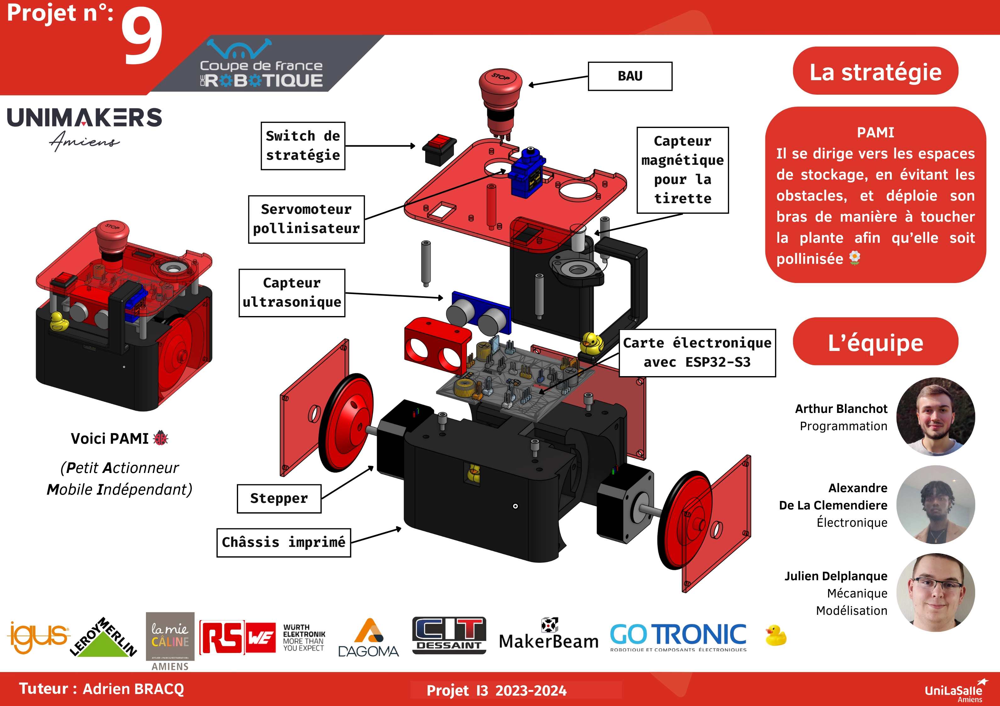

Terminée
{: .label .label-green }

# Les Docs de l'équipe I3 de la coupe de france de robotique 2024

Bienvenue sur la page du projet de la coupe de france de robotique. Vous allez y trouver les differents documentations ainsi que recherches que l'équipe a fait lors de la quete de constuire un robot, tout en itterant les designs

## In a nutshell

La coupe de robotique est un événement qui prend lieu chaque année à La Roche-sur-Yon,
de nombreux équipes de robtiques de différentes écoles d'ingénieurs ainsi que de lycées se 
rendent sur le lieu pendant 4 jours pour mettre au défi leurs robots, qu'ils auronts conçue lors de 9 mois préalable 

## Poster & vidéo - robot principal

<video src="images/Robot.webm" controls title="Title"  style="width: 100%;"></video>

## Poster & vidéo - PAMI

<!-- Vidéo journée des projets sur le PAMI -->

<video controls><source src="./images/pami-presentation_video.webm" type="video/webm" /></video>

## Vidéo

<video src="images/intro_unimakers.webm" controls title="Title"  style="width: 100%;"></video>
