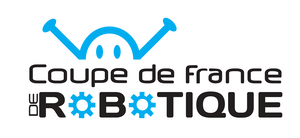

Terminée
{: .label .label-green }

  

La Coupe de France de Robotique, existant depuis plus de 30 ans, est une compétition annuelle qui rassemble des équipes d'étudiants de toute la France autour d'un défi technologique : concevoir, réaliser et faire concourir un robot autonome selon un cahier des charges précis.

Participer à cette compétition offre une opportunité inestimable de mettre en pratique leurs connaissances théoriques et de développer des compétences transversales en gestion de projet et en travail d'équipe.

Au fil des années, la Coupe est devenue une référence incontournable, reconnue par les recruteurs. En effet, bon nombre des anciens participants occupent aujourd'hui des postes clés dans l'industrie et sont eux-mêmes devenus des recruteurs, cherchant des talents ayant cette expérience unique.

La présence de l’école dans cette compétition renforce son image d'excellence et d'innovation dans le domaine de la technologie et de l'ingénierie, tout en démontrant notre engagement à se préparer aux défis du monde réel.

## Contexte du Projet

Dans un contexte associatif et dans le cadre de notre parcours d'études en ingénierie, nous cherchons à améliorer nos compétences en robotique grâce à un projet concret, une possibilité offerte par la Coupe de France de Robotique. 

Tout au long du projet, nous avons été amenés à effectuer des recherches pluridisciplinaires, tout en utilisant les ressources disponibles (internet, contacts).

## Objectifs du Projet

En neuf mois, l'équipe a construit un robot capable de réaliser plusieurs tâches :

- Prendre une plante et la planter dans un potager ou une jardinière selon la couleur.
- Mettre la plante dans un pot et la planter partout.
- Tourner le panneau solaire vers la couleur de son camp.
- Être actif pendant 90 secondes.

Particularité de cette année, lors de la compétition, des petits robots appelés P.A.M.I. peuvent également effectuer plusieurs tâches :

- Se déplacer à la 90e seconde et s'éteindre au bout de 100 secondes.
- Être dans une zone spécifique.
- Toucher une plante.

# Existant

De nombreux robots existent déjà. Le robot actuel est basé sur des robots à motorisation différentielle réalisés auparavant par l'ancien club A.R.E.A.

# Cahier des Charges

Le cahier des charges est en partie imposé par le règlement de la Coupe de France de Robotique, que vous pouvez retrouver dans le PDF suivant.

<embed src="files/Eurobot2024_Rules.pdf" type="application/pdf" width="100%" height="600px" />

[Reglement de la coupe de france de robotique](https://www.coupederobotique.fr/wp-content/uploads/Eurobot2024_Rules_CUP_FR_FINAL.pdf)
